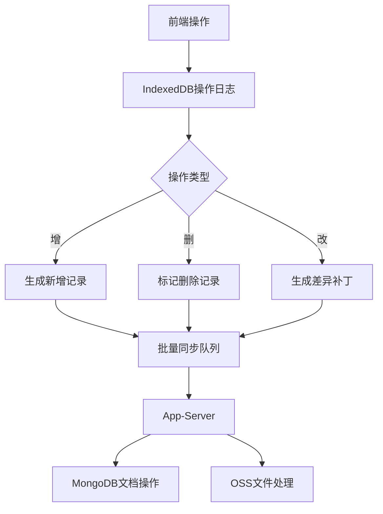

```mermaid
flowchart TD
    A[前端操作] --> B[IndexedDB操作日志]
    B --> C{操作类型}
    C -->|增| D[生成新增记录]
    C -->|删| E[标记删除记录]
    C -->|改| F[生成差异补丁]
    D & E & F --> G[批量同步队列]
    G --> H[App-Server]
    H --> I[MongoDB文档操作]
    H --> J[OSS文件处理]
```