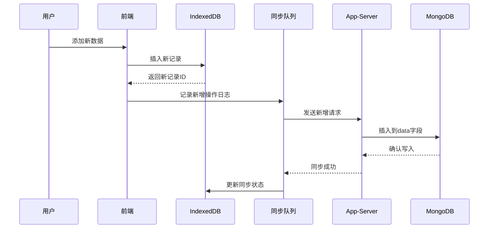

```mermaid
sequenceDiagram
    participant 用户
    participant 前端
    participant IndexedDB
    participant 同步队列
    participant App-Server
    participant MongoDB

    用户->>前端: 添加新数据
    前端->>IndexedDB: 插入新记录
    IndexedDB-->>前端: 返回新记录ID
    前端->>同步队列: 记录新增操作日志
    同步队列->>App-Server: 发送新增请求
    App-Server->>MongoDB: 插入到data字段
    MongoDB-->>App-Server: 确认写入
    App-Server-->>同步队列: 同步成功
    同步队列->>IndexedDB: 更新同步状态
```