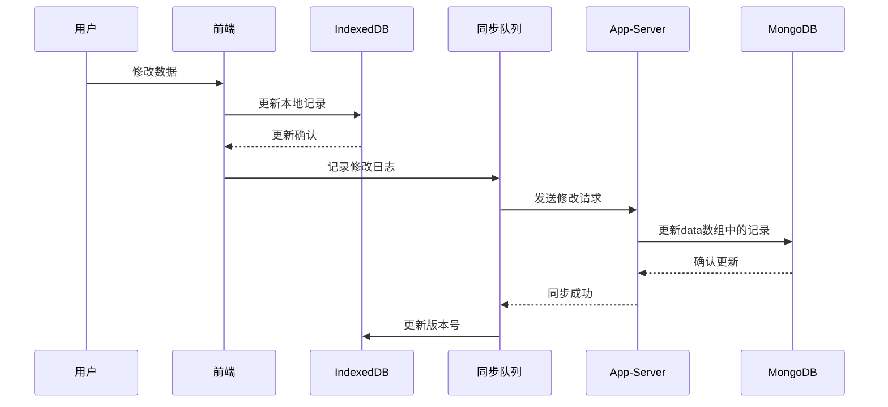

```mermaid
sequenceDiagram
    participant 用户
    participant 前端
    participant IndexedDB
    participant 同步队列
    participant App-Server
    participant MongoDB

    用户->>前端: 修改数据
    前端->>IndexedDB: 更新本地记录
    IndexedDB-->>前端: 更新确认
    前端->>同步队列: 记录修改日志
    同步队列->>App-Server: 发送修改请求
    App-Server->>MongoDB: 更新data数组中的记录
    MongoDB-->>App-Server: 确认更新
    App-Server-->>同步队列: 同步成功
    同步队列->>IndexedDB: 更新版本号
```