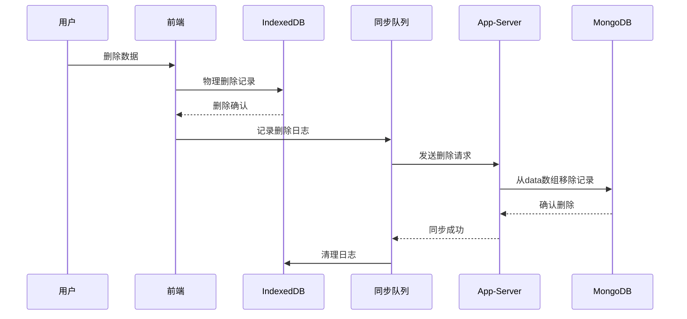

```mermaid
sequenceDiagram
    participant 用户
    participant 前端
    participant IndexedDB
    participant 同步队列
    participant App-Server
    participant MongoDB

    用户->>前端: 删除数据
    前端->>IndexedDB: 物理删除记录
    IndexedDB-->>前端: 删除确认
    前端->>同步队列: 记录删除日志
    同步队列->>App-Server: 发送删除请求
    App-Server->>MongoDB: 从data数组移除记录
    MongoDB-->>App-Server: 确认删除
    App-Server-->>同步队列: 同步成功
    同步队列->>IndexedDB: 清理日志
```