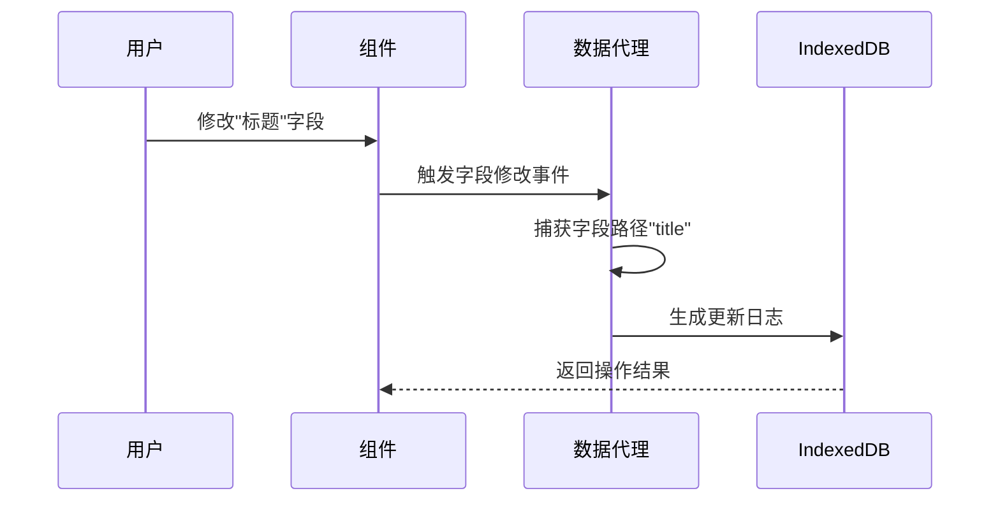

```mermaid
sequenceDiagram
    participant 用户
    participant 组件
    participant 数据代理
    participant IndexedDB

    用户->>组件: 修改"标题"字段
    组件->>数据代理: 触发字段修改事件
    数据代理->>数据代理: 捕获字段路径"title"
    数据代理->>IndexedDB: 生成更新日志
    IndexedDB-->>组件: 返回操作结果
```