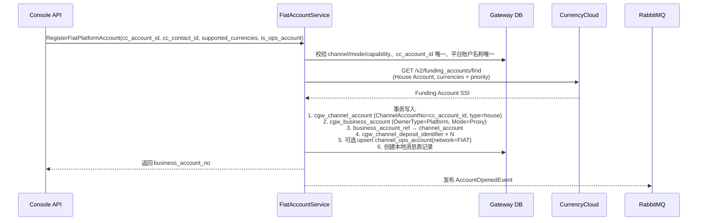

```mermaid
sequenceDiagram
    participant API as Console API
    participant Svc as FiatAccountService
    participant DB as Gateway DB
    participant CC as CurrencyCloud
    participant MQ as RabbitMQ

    API->>Svc: RegisterFiatPlatformAccount(cc_account_id, cc_contact_id, supported_currencies, is_ops_account)
    Svc->>DB: 校验 channel/mode/capability、cc_account_id 唯一、平台账户名称唯一
    Svc->>CC: GET /v2/funding_accounts/find<br/>(House Account, currencies × priority)
    CC-->>Svc: Funding Account SSI
    Svc->>DB: 事务写入:<br/>1. cgw_channel_account (ChannelAccountNo=cc_account_id, type=house)<br/>2. cgw_business_account (OwnerType=Platform, Mode=Proxy)<br/>3. business_account_ref → channel_account<br/>4. cgw_channel_deposit_identifier × N<br/>5. 可选 upsert channel_ops_account(network=FIAT)<br/>6. 创建本地消息表记录
    Svc-->>API: 返回 business_account_no
    Svc-->>MQ: 发布 AccountOpenedEvent

```