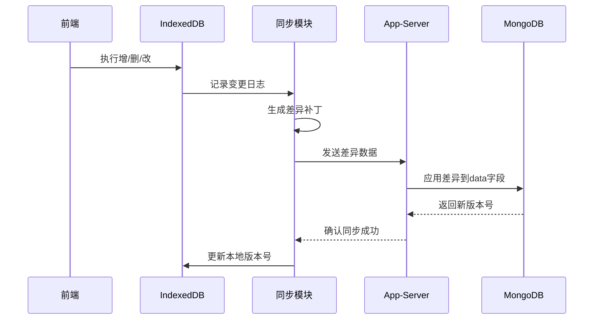

```mermaid
sequenceDiagram
    participant 前端
    participant IndexedDB
    participant 同步模块
    participant App-Server
    participant MongoDB

    前端->>IndexedDB: 执行增/删/改
    IndexedDB->>同步模块: 记录变更日志
    同步模块->>同步模块: 生成差异补丁
    同步模块->>App-Server: 发送差异数据
    App-Server->>MongoDB: 应用差异到data字段
    MongoDB-->>App-Server: 返回新版本号
    App-Server-->>同步模块: 确认同步成功
    同步模块->>IndexedDB: 更新本地版本号
```