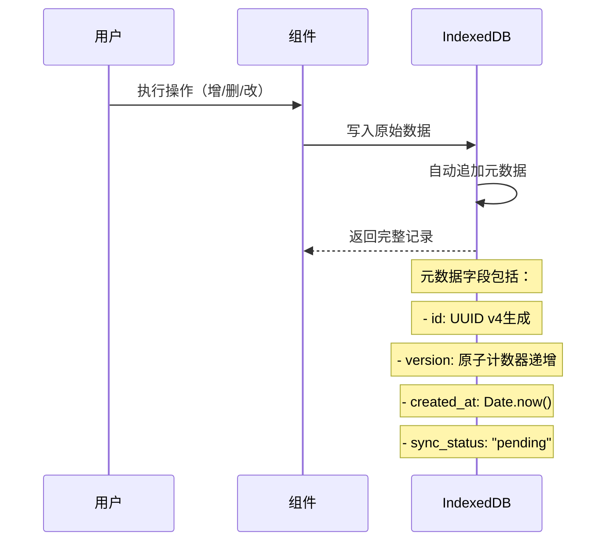

```mermaid
sequenceDiagram
    participant 用户
    participant 组件
    participant IndexedDB

    用户->>组件: 执行操作（增/删/改）
    组件->>IndexedDB: 写入原始数据
    IndexedDB->>IndexedDB: 自动追加元数据
    IndexedDB-->>组件: 返回完整记录

    Note over IndexedDB: 元数据字段包括：
    Note over IndexedDB: - id: UUID v4生成
    Note over IndexedDB: - version: 原子计数器递增
    Note over IndexedDB: - created_at: Date.now()
    Note over IndexedDB: - sync_status: "pending"
```