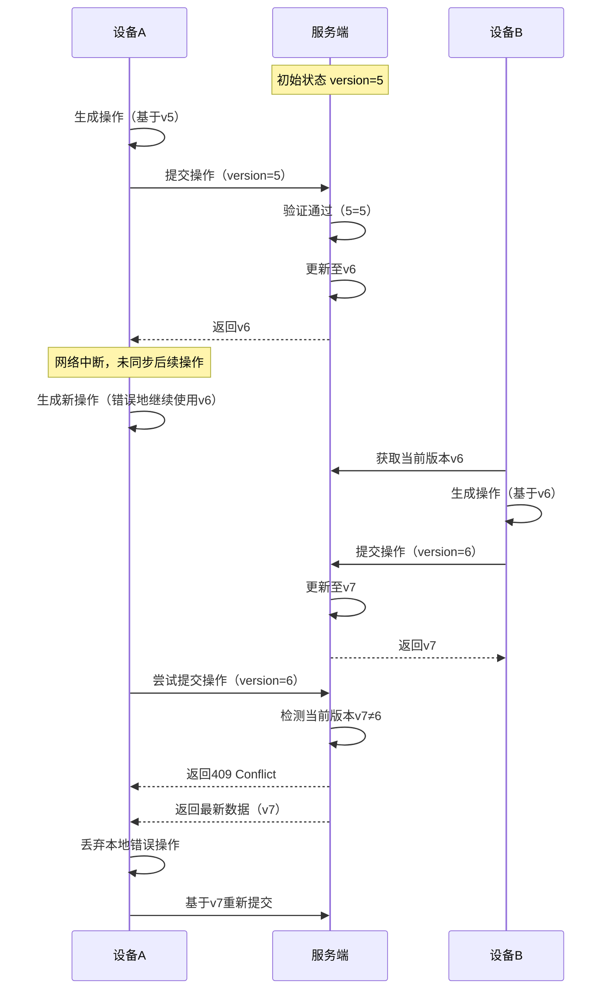

```mermaid
sequenceDiagram
    participant A as 设备A
    participant S as 服务端
    participant B as 设备B

    Note over S: 初始状态 version=5
    A->>A: 生成操作（基于v5）
    A->>S: 提交操作（version=5）
    S->>S: 验证通过（5=5）
    S->>S: 更新至v6
    S-->>A: 返回v6

    Note over A: 网络中断，未同步后续操作
    A->>A: 生成新操作（错误地继续使用v6）

    B->>S: 获取当前版本v6
    B->>B: 生成操作（基于v6）
    B->>S: 提交操作（version=6）
    S->>S: 更新至v7
    S-->>B: 返回v7

    A->>S: 尝试提交操作（version=6）
    S->>S: 检测当前版本v7≠6
    S-->>A: 返回409 Conflict
    S-->>A: 返回最新数据（v7）
    A->>A: 丢弃本地错误操作
    A->>S: 基于v7重新提交
```