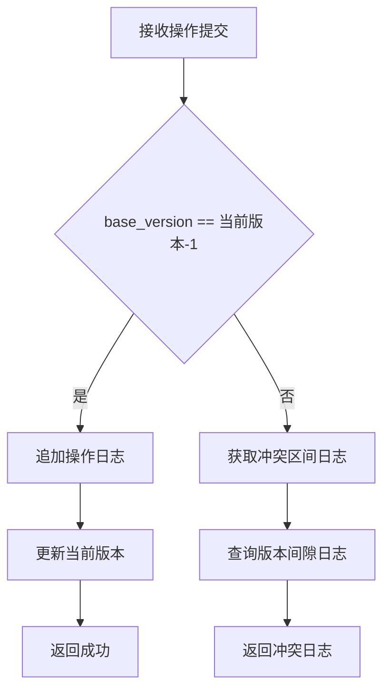

```mermaid
flowchart TB
    Start[接收操作提交] --> CheckVersion{base_version == 当前版本-1}
    
    CheckVersion -->|是| AppendLog[追加操作日志]
    CheckVersion -->|否| GetConflictLogs[获取冲突区间日志]
    
    AppendLog --> UpdateVersion[更新当前版本]
    UpdateVersion --> ReturnSuccess[返回成功]
    
    GetConflictLogs --> FindGap[查询版本间隙日志]
    FindGap --> ReturnConflict[返回冲突日志]
```