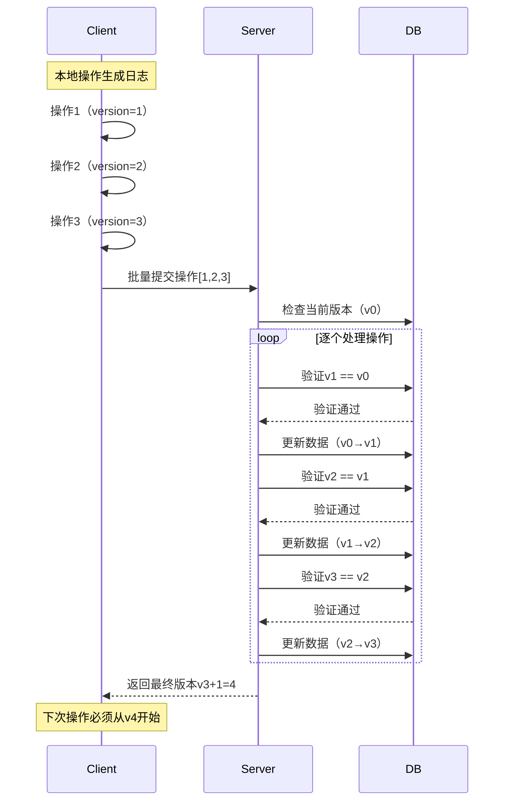

```mermaid
sequenceDiagram
    participant Client
    participant Server
    participant DB

    Note over Client: 本地操作生成日志
    Client->>Client: 操作1（version=1）
    Client->>Client: 操作2（version=2）
    Client->>Client: 操作3（version=3）

    Client->>Server: 批量提交操作[1,2,3]
    Server->>DB: 检查当前版本（v0）
    
    loop 逐个处理操作
        Server->>DB: 验证v1 == v0
        DB-->>Server: 验证通过
        Server->>DB: 更新数据（v0→v1）
        Server->>DB: 验证v2 == v1
        DB-->>Server: 验证通过
        Server->>DB: 更新数据（v1→v2）
        Server->>DB: 验证v3 == v2
        DB-->>Server: 验证通过
        Server->>DB: 更新数据（v2→v3）
    end
    
    Server-->>Client: 返回最终版本v3+1=4

    Note over Client: 下次操作必须从v4开始
```