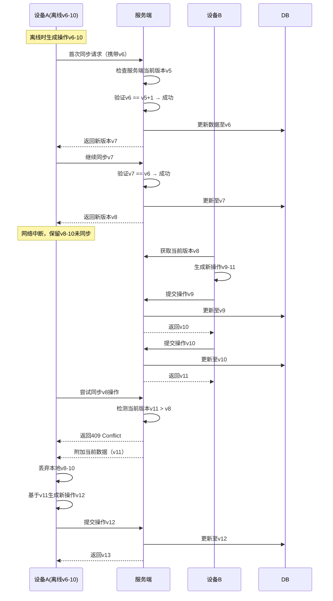

```mermaid
sequenceDiagram
    participant A as 设备A(离线v6-10)
    participant S as 服务端
    participant B as 设备B

    Note over A: 离线时生成操作v6-10
    A->>S: 首次同步请求（携带v6）
    S->>S: 检查服务端当前版本v5
    S->>S: 验证v6 == v5+1 → 成功
    S->>DB: 更新数据至v6
    S-->>A: 返回新版本v7

    A->>S: 继续同步v7
    S->>S: 验证v7 == v6 → 成功
    S->>DB: 更新至v7
    S-->>A: 返回新版本v8

    Note over A: 网络中断，保留v8-10未同步

    B->>S: 获取当前版本v8
    B->>B: 生成新操作v9-11
    B->>S: 提交操作v9
    S->>DB: 更新至v9
    S-->>B: 返回v10
    B->>S: 提交操作v10
    S->>DB: 更新至v10
    S-->>B: 返回v11

    A->>S: 尝试同步v8操作
    S->>S: 检测当前版本v11 > v8
    S-->>A: 返回409 Conflict
    S-->>A: 附加当前数据（v11）
    A->>A: 丢弃本地v8-10
    A->>A: 基于v11生成新操作v12
    A->>S: 提交操作v12
    S->>DB: 更新至v12
    S-->>A: 返回v13
```