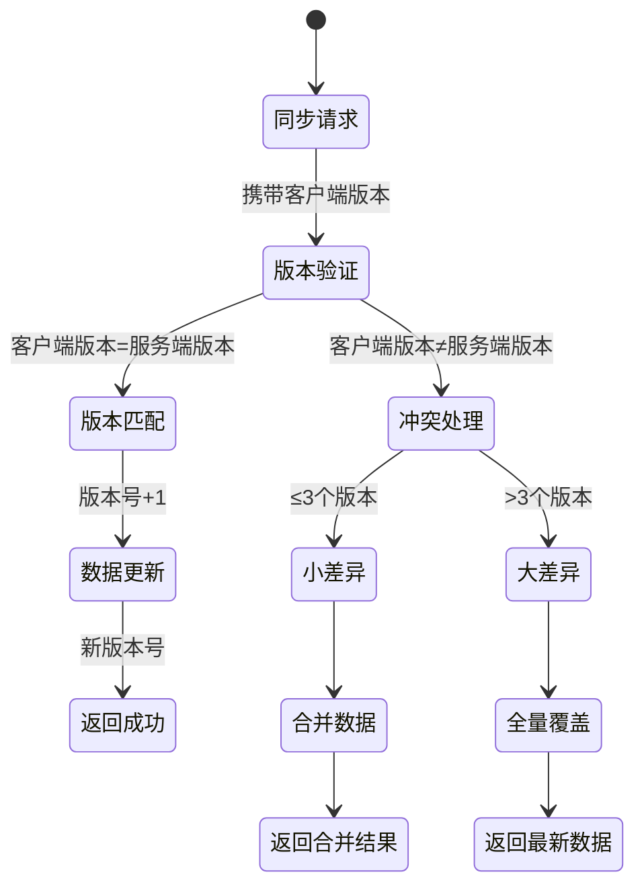

```mermaid
stateDiagram-v2
    [*] --> 同步请求
    同步请求 --> 版本验证: 携带客户端版本
    版本验证 --> 版本匹配: 客户端版本=服务端版本
    版本验证 --> 冲突处理: 客户端版本≠服务端版本
    
    版本匹配 --> 数据更新: 版本号+1
    数据更新 --> 返回成功: 新版本号
    
    冲突处理 --> 小差异: ≤3个版本
    冲突处理 --> 大差异: >3个版本
    小差异 --> 合并数据
    大差异 --> 全量覆盖
    
    合并数据 --> 返回合并结果
    全量覆盖 --> 返回最新数据
```