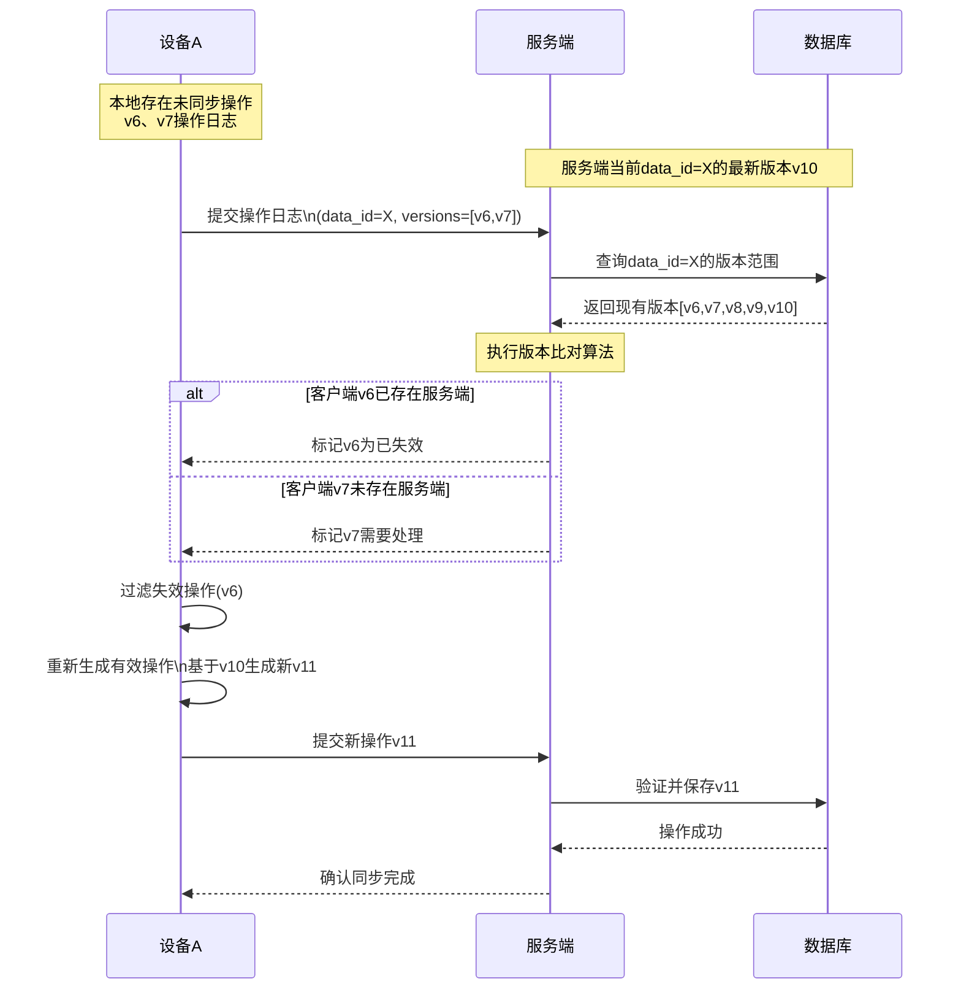

```mermaid
sequenceDiagram
    participant DeviceA as 设备A
    participant Server as 服务端
    participant MongoDB as 数据库

    %% 初始状态
    Note over DeviceA: 本地存在未同步操作 <br> v6、v7操作日志
    Note over Server,MongoDB: 服务端当前data_id=X的最新版本v10

    %% 同步尝试
    DeviceA->>Server: 提交操作日志\n(data_id=X, versions=[v6,v7])
    Server->>MongoDB: 查询data_id=X的版本范围
    MongoDB-->>Server: 返回现有版本[v6,v7,v8,v9,v10]

    %% 版本比对阶段
    Note over Server: 执行版本比对算法
    alt 客户端v6已存在服务端
        Server-->>DeviceA: 标记v6为已失效
    else 客户端v7未存在服务端
        Server-->>DeviceA: 标记v7需要处理
    end

    %% 冲突解决阶段
    DeviceA->>DeviceA: 过滤失效操作(v6)
    DeviceA->>DeviceA: 重新生成有效操作\n基于v10生成新v11

    %% 最终提交
    DeviceA->>Server: 提交新操作v11
    Server->>MongoDB: 验证并保存v11
    MongoDB-->>Server: 操作成功
    Server-->>DeviceA: 确认同步完成
```