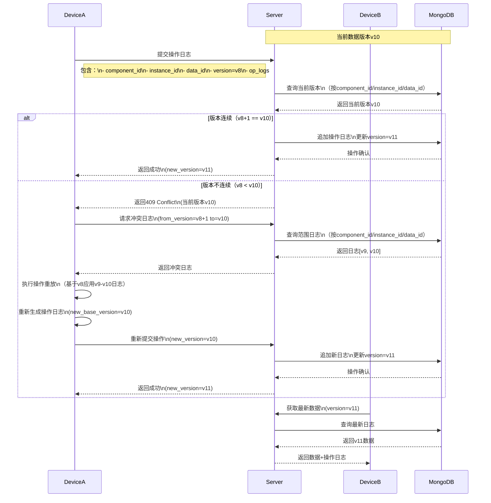

```mermaid
sequenceDiagram
    participant DeviceA
    participant Server
    participant DeviceB
    participant MongoDB

    %% 初始状态：服务端当前版本为v10
    Note over Server,MongoDB: 当前数据版本v10

    %% 设备A尝试提交离线操作
    DeviceA->>Server: 提交操作日志
    Note right of DeviceA: 包含：\n- component_id\n- instance_id\n- data_id\n- version=v8\n- op_logs

    Server->>MongoDB: 查询当前版本\n（按component_id/instance_id/data_id）
    MongoDB-->>Server: 返回当前版本v10

    %% 版本冲突检测
    alt 版本连续（v8+1 == v10）
        Server->>MongoDB: 追加操作日志\n更新version=v11
        MongoDB-->>Server: 操作确认
        Server-->>DeviceA: 返回成功\n(new_version=v11)
    else 版本不连续（v8 < v10）
        %% 冲突处理流程
        Server-->>DeviceA: 返回409 Conflict\n(当前版本v10)
        
        DeviceA->>Server: 请求冲突日志\n(from_version=v8+1 to=v10)
        Server->>MongoDB: 查询范围日志\n（按component_id/instance_id/data_id）
        MongoDB-->>Server: 返回日志[v9, v10]
        Server-->>DeviceA: 返回冲突日志

        %% 客户端自动合并
        DeviceA->>DeviceA: 执行操作重放\n（基于v8应用v9-v10日志）
        DeviceA->>DeviceA: 重新生成操作日志\n(new_base_version=v10)
        
        DeviceA->>Server: 重新提交操作\n(new_version=v10)
        Server->>MongoDB: 追加新日志\n更新version=v11
        MongoDB-->>Server: 操作确认
        Server-->>DeviceA: 返回成功\n(new_version=v11)
    end

    %% 其他设备同步场景
    DeviceB->>Server: 获取最新数据\n(version=v11)
    Server->>MongoDB: 查询最新日志
    MongoDB-->>Server: 返回v11数据
    Server-->>DeviceB: 返回数据+操作日志
```