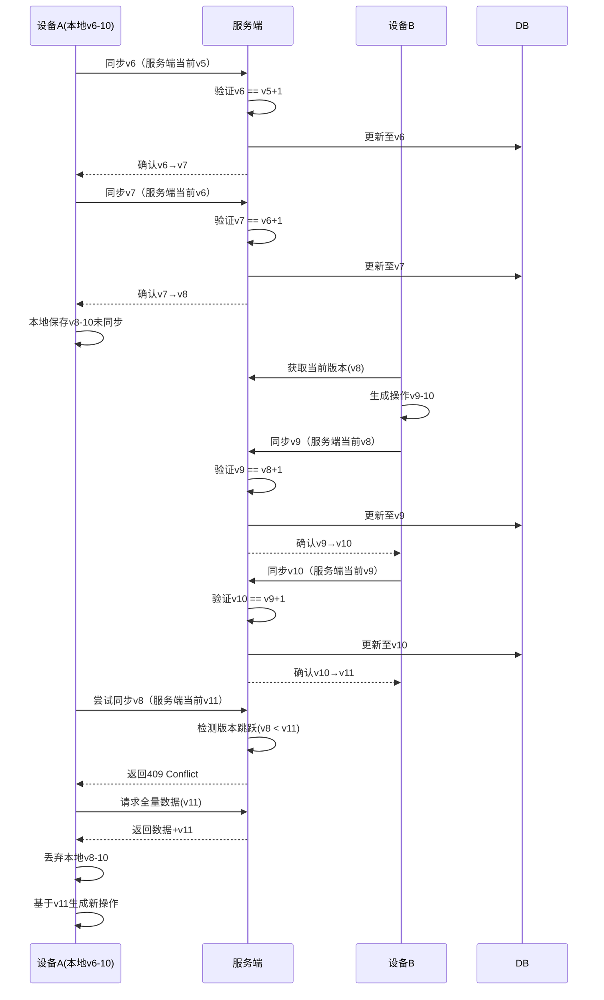

```mermaid
sequenceDiagram
    participant A as 设备A(本地v6-10)
    participant S as 服务端
    participant B as 设备B

    A->>S: 同步v6（服务端当前v5）
    S->>S: 验证v6 == v5+1
    S->>DB: 更新至v6
    S-->>A: 确认v6→v7
    
    A->>S: 同步v7（服务端当前v6）
    S->>S: 验证v7 == v6+1
    S->>DB: 更新至v7
    S-->>A: 确认v7→v8
    
    A->>A: 本地保存v8-10未同步
    
    B->>S: 获取当前版本(v8)
    B->>B: 生成操作v9-10
    
    B->>S: 同步v9（服务端当前v8）
    S->>S: 验证v9 == v8+1
    S->>DB: 更新至v9
    S-->>B: 确认v9→v10
    
    B->>S: 同步v10（服务端当前v9）
    S->>S: 验证v10 == v9+1
    S->>DB: 更新至v10
    S-->>B: 确认v10→v11
    
    A->>S: 尝试同步v8（服务端当前v11）
    S->>S: 检测版本跳跃(v8 < v11)
    S-->>A: 返回409 Conflict
    A->>S: 请求全量数据(v11)
    S-->>A: 返回数据+v11
    A->>A: 丢弃本地v8-10
    A->>A: 基于v11生成新操作
```