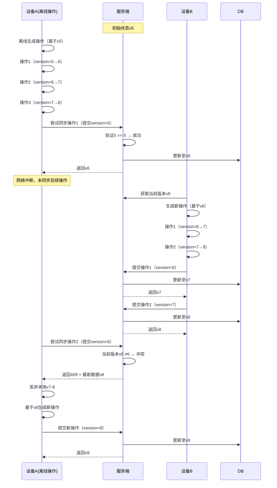

```mermaid
sequenceDiagram
    participant A as 设备A(离线操作)
    participant S as 服务端
    participant B as 设备B

    Note over S: 初始状态v5
    A->>A: 离线生成操作（基于v5）
    A->>A: 操作1（version=5→6）
    A->>A: 操作2（version=6→7）
    A->>A: 操作3（version=7→8）

    A->>S: 尝试同步操作1（提交version=5）
    S->>S: 验证5 == 5 → 成功
    S->>DB: 更新至v6
    S-->>A: 返回v6

    Note over A: 网络中断，未同步后续操作

    B->>S: 获取当前版本v6
    B->>B: 生成新操作（基于v6）
    B->>B: 操作1（version=6→7）
    B->>B: 操作2（version=7→8）

    B->>S: 提交操作1（version=6）
    S->>DB: 更新至v7
    S-->>B: 返回v7

    B->>S: 提交操作2（version=7）
    S->>DB: 更新至v8
    S-->>B: 返回v8

    A->>S: 尝试同步操作2（提交version=6）
    S->>S: 当前版本v8 ≠6 → 冲突
    S-->>A: 返回409 + 最新数据v8
    A->>A: 丢弃本地v7-8
    A->>A: 基于v8生成新操作
    A->>S: 提交新操作（version=8）
    S->>DB: 更新至v9
    S-->>A: 返回v9
```