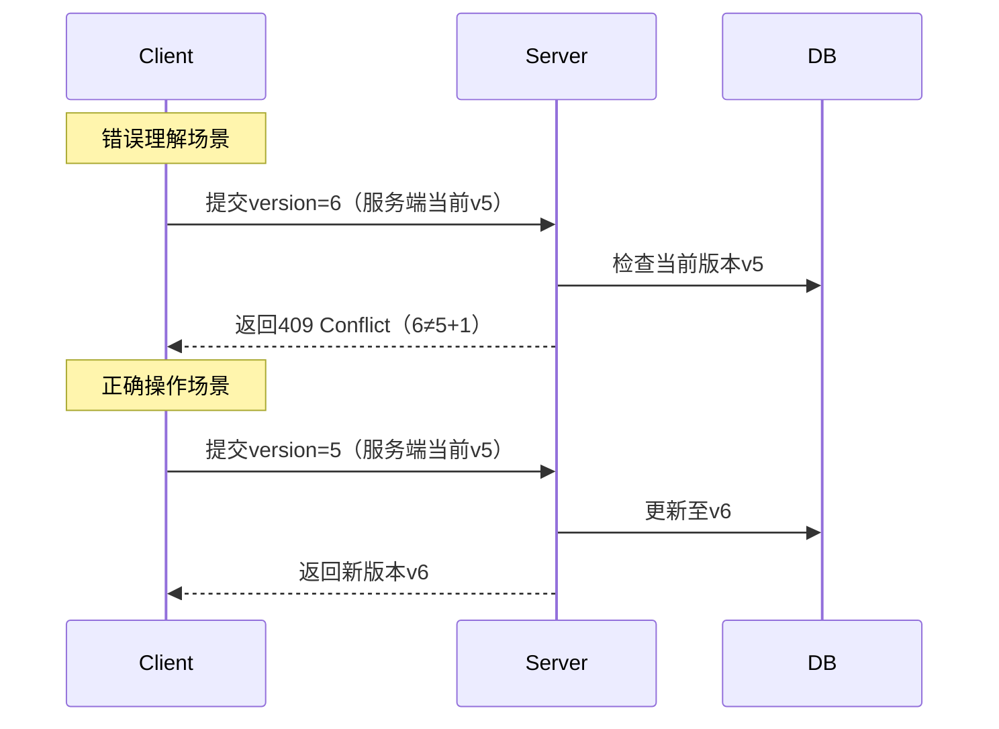

```mermaid
sequenceDiagram
    participant Client
    participant Server
    participant DB

    Note over Client: 错误理解场景
    Client->>Server: 提交version=6（服务端当前v5）
    Server->>DB: 检查当前版本v5
    Server-->>Client: 返回409 Conflict（6≠5+1）

    Note over Client: 正确操作场景
    Client->>Server: 提交version=5（服务端当前v5）
    Server->>DB: 更新至v6
    Server-->>Client: 返回新版本v6
```