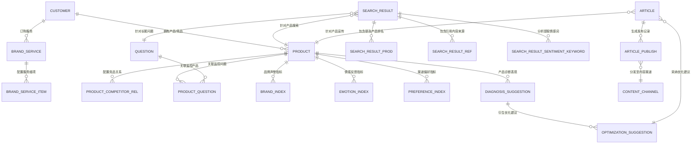

```mermaid
erDiagram
    CUSTOMER ||--o{ PRODUCT : "拥有产品/竞品"
    CUSTOMER ||--o{ BRAND_SERVICE : "订购服务"
    BRAND_SERVICE ||--o{ BRAND_SERVICE_ITEM : "配置服务细项"
    
    PRODUCT ||--o{ PRODUCT_COMPETITOR_REL : "配置竞品关系"
    PRODUCT ||--o{ PRODUCT_QUESTION : "关联监控问题"
    QUESTION ||--o{ PRODUCT_QUESTION : "关联监控产品"
    
    SEARCH_RESULT }o--|| PRODUCT : "针对产品搜索"
    SEARCH_RESULT }o--|| QUESTION : "针对长尾问题"
    SEARCH_RESULT ||--o{ SEARCH_RESULT_PROD : "包含提及产品排名"
    SEARCH_RESULT ||--o{ SEARCH_RESULT_REF : "包含引用内容来源"
    SEARCH_RESULT ||--o{ SEARCH_RESULT_SENTIMENT_KEYWORD : "分析提取情感词"
    
    PRODUCT ||--o{ BRAND_INDEX : "品牌声誉指标"
    PRODUCT ||--o{ EMOTION_INDEX : "情感反馈指标"
    PRODUCT ||--o{ PREFERENCE_INDEX : "渠道偏好指标"
    
    PRODUCT ||--o{ DIAGNOSIS_SUGGESTION : "产品诊断表现"
    DIAGNOSIS_SUGGESTION ||--o{ OPTIMIZATION_SUGGESTION : "衍生优化建议"
    
    ARTICLE }o--|| PRODUCT : "针对产品宣传"
    ARTICLE }o--|| OPTIMIZATION_SUGGESTION : "采纳优化建议"
    ARTICLE ||--o{ ARTICLE_PUBLISH : "生成发布记录"
    ARTICLE_PUBLISH }o--|| CONTENT_CHANNEL : "分发至内容渠道"
```