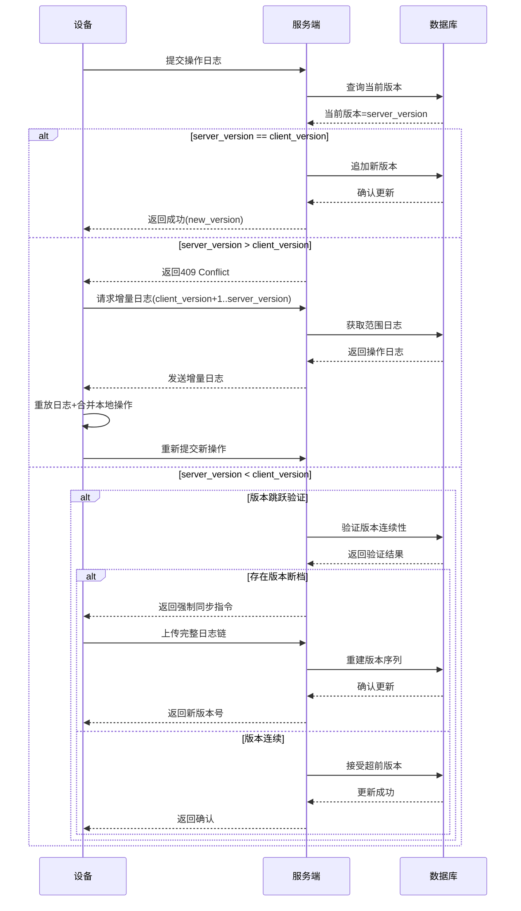

```mermaid
sequenceDiagram
    participant D as 设备
    participant S as 服务端
    participant DB as 数据库

    %% 同步发起
    D->>S: 提交操作日志
    S->>DB: 查询当前版本
    DB-->>S: 当前版本=server_version

    alt server_version == client_version
        %% 场景1：版本一致
        S->>DB: 追加新版本
        DB-->>S: 确认更新
        S-->>D: 返回成功(new_version)
    else server_version > client_version
        %% 场景2：服务端版本更新
        S-->>D: 返回409 Conflict
        D->>S: 请求增量日志(client_version+1..server_version)
        S->>DB: 获取范围日志
        DB-->>S: 返回操作日志
        S-->>D: 发送增量日志
        D->>D: 重放日志+合并本地操作
        D->>S: 重新提交新操作
    else server_version < client_version
        %% 场景3：客户端版本超前
        alt 版本跳跃验证
            S->>DB: 验证版本连续性
            DB-->>S: 返回验证结果
            alt 存在版本断档
                S-->>D: 返回强制同步指令
                D->>S: 上传完整日志链
                S->>DB: 重建版本序列
                DB-->>S: 确认更新
                S-->>D: 返回新版本号
            else 版本连续
                S->>DB: 接受超前版本
                DB-->>S: 更新成功
                S-->>D: 返回确认
            end
        end
    end
```