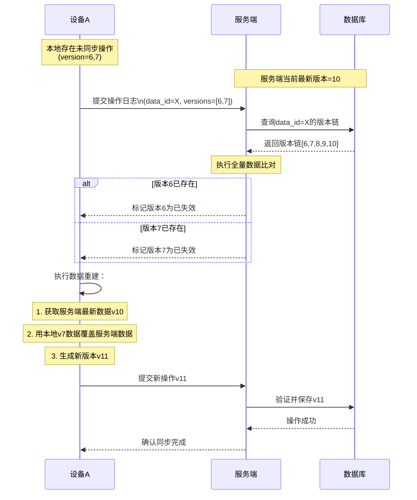

```mermaid
sequenceDiagram
    participant DeviceA as 设备A
    participant Server as 服务端
    participant MongoDB as 数据库

    %% 初始状态
    Note over DeviceA: 本地存在未同步操作 <br>(version=6,7)
    Note over Server,MongoDB: 服务端当前最新版本=10

    %% 同步尝试
    DeviceA->>Server: 提交操作日志\n(data_id=X, versions=[6,7])
    Server->>MongoDB: 查询data_id=X的版本链
    MongoDB-->>Server: 返回版本链[6,7,8,9,10]

    %% 版本比对阶段
    Note over Server: 执行全量数据比对
    alt 版本6已存在
        Server-->>DeviceA: 标记版本6为已失效
    else 版本7已存在
        Server-->>DeviceA: 标记版本7为已失效
    end

    %% 冲突解决核心逻辑
    DeviceA->>DeviceA: 执行数据重建：
    Note over DeviceA: 1. 获取服务端最新数据v10
    Note over DeviceA: 2. 用本地v7数据覆盖服务端数据
    Note over DeviceA: 3. 生成新版本v11

    %% 最终提交
    DeviceA->>Server: 提交新操作v11
    Server->>MongoDB: 验证并保存v11
    MongoDB-->>Server: 操作成功
    Server-->>DeviceA: 确认同步完成
```