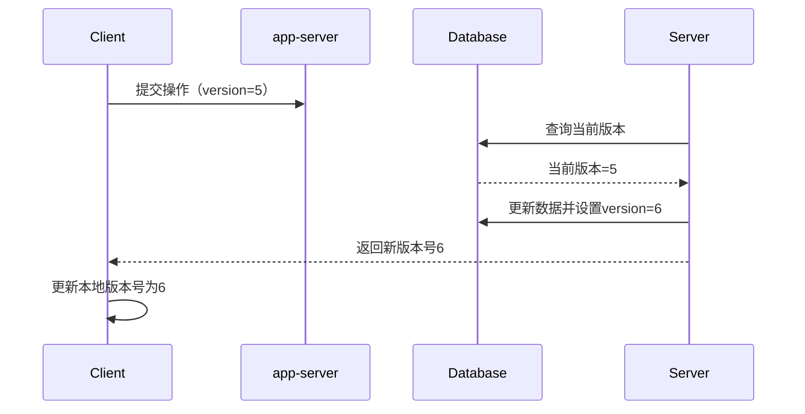

```mermaid

sequenceDiagram
    participant Client
    participant app-server
    participant Database

    Client->>app-server: 提交操作（version=5）
    Server->>Database: 查询当前版本
    Database-->>Server: 当前版本=5
    Server->>Database: 更新数据并设置version=6
    Server-->>Client: 返回新版本号6
    Client->>Client: 更新本地版本号为6

```