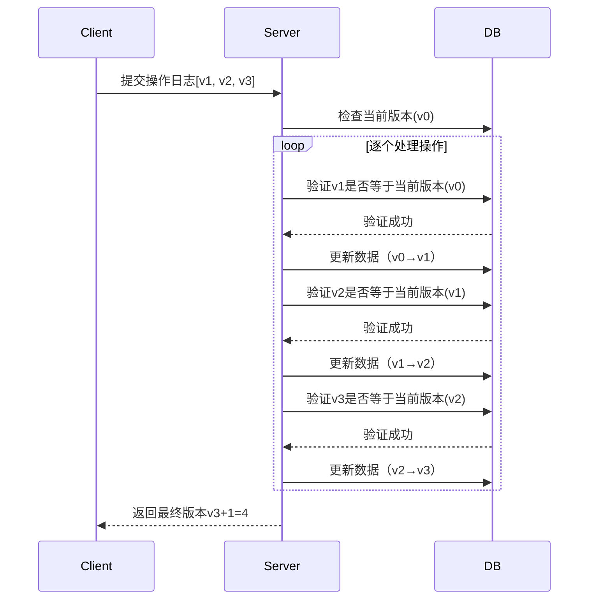

```mermaid
sequenceDiagram
    participant Client
    participant Server
    participant DB

    Client->>Server: 提交操作日志[v1, v2, v3]
    Server->>DB: 检查当前版本(v0)
    
    loop 逐个处理操作
        Server->>DB: 验证v1是否等于当前版本(v0)
        DB-->>Server: 验证成功
        Server->>DB: 更新数据（v0→v1）
        Server->>DB: 验证v2是否等于当前版本(v1)
        DB-->>Server: 验证成功
        Server->>DB: 更新数据（v1→v2）
        Server->>DB: 验证v3是否等于当前版本(v2)
        DB-->>Server: 验证成功
        Server->>DB: 更新数据（v2→v3）
    end
    
    Server-->>Client: 返回最终版本v3+1=4
```