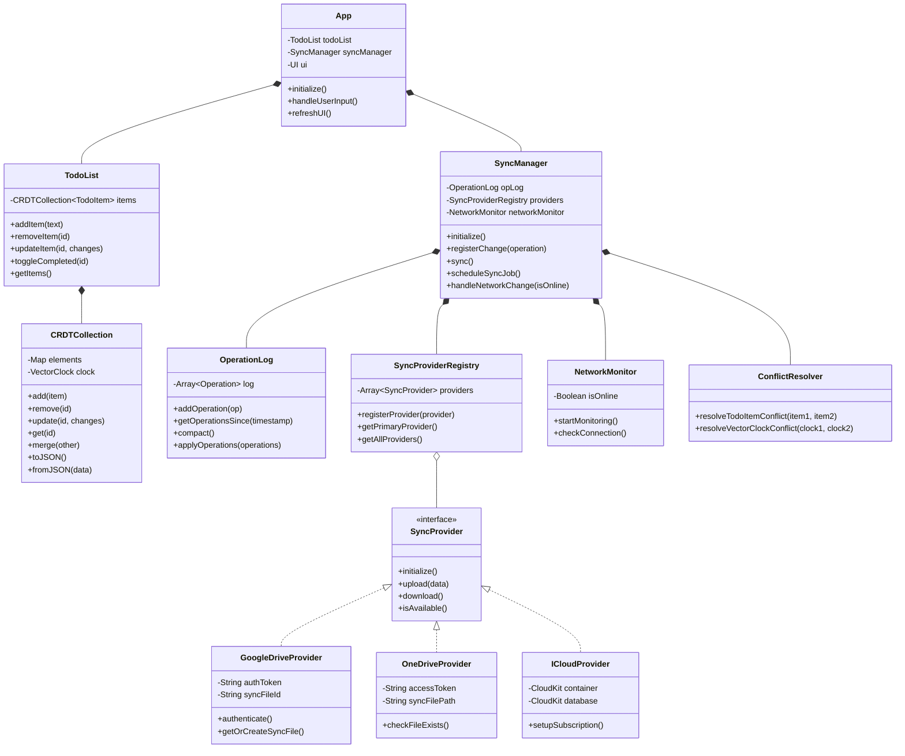

```mermaid
classDiagram
    class App {
        -TodoList todoList
        -SyncManager syncManager
        -UI ui
        +initialize()
        +handleUserInput()
        +refreshUI()
    }
    
    class TodoList {
        -CRDTCollection~TodoItem~ items
        +addItem(text)
        +removeItem(id)
        +updateItem(id, changes)
        +toggleCompleted(id)
        +getItems()
    }
    
    class CRDTCollection {
        -Map elements
        -VectorClock clock
        +add(item)
        +remove(id)
        +update(id, changes)
        +get(id)
        +merge(other)
        +toJSON()
        +fromJSON(data)
    }
    
    class SyncManager {
        -OperationLog opLog
        -SyncProviderRegistry providers
        -NetworkMonitor networkMonitor
        +initialize()
        +registerChange(operation)
        +sync()
        +scheduleSyncJob()
        +handleNetworkChange(isOnline)
    }
    
    class OperationLog {
        -Array~Operation~ log
        +addOperation(op)
        +getOperationsSince(timestamp)
        +compact()
        +applyOperations(operations)
    }
    
    class SyncProviderRegistry {
        -Array~SyncProvider~ providers
        +registerProvider(provider)
        +getPrimaryProvider()
        +getAllProviders()
    }
    
    class SyncProvider {
        <<interface>>
        +initialize()
        +upload(data)
        +download()
        +isAvailable()
    }
    
    class GoogleDriveProvider {
        -String authToken
        -String syncFileId
        +authenticate()
        +getOrCreateSyncFile()
    }
    
    class OneDriveProvider {
        -String accessToken
        -String syncFilePath
        +checkFileExists()
    }
    
    class ICloudProvider {
        -CloudKit container
        -CloudKit database
        +setupSubscription()
    }
    
    class NetworkMonitor {
        -Boolean isOnline
        +startMonitoring()
        +checkConnection()
    }
    
    class ConflictResolver {
        +resolveTodoItemConflict(item1, item2)
        +resolveVectorClockConflict(clock1, clock2)
    }
    
    App *-- TodoList
    App *-- SyncManager
    TodoList *-- CRDTCollection
    SyncManager *-- OperationLog
    SyncManager *-- SyncProviderRegistry
    SyncManager *-- NetworkMonitor
    SyncManager *-- ConflictResolver
    SyncProviderRegistry o-- SyncProvider
    SyncProvider <|.. GoogleDriveProvider
    SyncProvider <|.. OneDriveProvider
    SyncProvider <|.. ICloudProvider
```