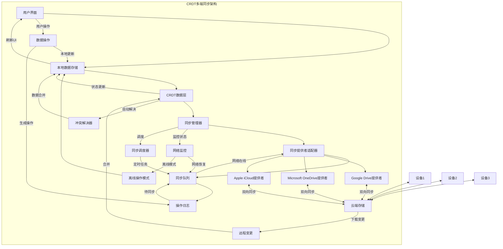

```mermaid
graph TD
    subgraph "CRDT多端同步架构"
    
    %% 核心组件
    UI[用户界面] --> DataStore[本地数据存储]
    DataStore --> CRDTLayer[CRDT数据层]
    CRDTLayer --> SyncManager[同步管理器]
    
    %% 同步层
    SyncManager --> ProviderAdapter[同步提供者适配器]
    ProviderAdapter --> SyncQueue[同步队列]
    SyncQueue --> OpLog[操作日志]
    
    %% 云存储提供者
    ProviderAdapter --> GDrive[Google Drive提供者]
    ProviderAdapter --> OneDrive[Microsoft OneDrive提供者]
    ProviderAdapter --> ICloud[Apple iCloud提供者]
    
    %% 同步流程
    UI -->|用户操作| DataOperations[数据操作]
    DataOperations -->|本地更新| DataStore
    DataOperations -->|生成操作| OpLog
    OpLog -->|待同步| SyncQueue
    SyncQueue -->|网络在线| ProviderAdapter
    
    %% 云端同步
    GDrive <-->|双向同步| CloudStorage[云端存储]
    OneDrive <-->|双向同步| CloudStorage
    ICloud <-->|双向同步| CloudStorage
    
    %% 数据流
    CloudStorage -->|下载变更| RemoteChanges[远程变更]
    RemoteChanges -->|合并| CRDTLayer
    CRDTLayer -->|状态更新| DataStore
    DataStore -->|刷新UI| UI
    
    %% 离线处理
    SyncManager -->|监控状态| NetworkMonitor[网络监控]
    NetworkMonitor -->|网络恢复| SyncQueue
    NetworkMonitor -->|离线模式| OfflineMode[离线操作模式]
    OfflineMode --> DataStore
    
    %% 冲突解决
    CRDTLayer -->|自动解决| ConflictResolver[冲突解决器]
    ConflictResolver -->|数据合并| DataStore
    
    %% 其他组件
    SyncManager -->|调度| SyncScheduler[同步调度器]
    SyncScheduler -->|定时任务| SyncQueue
    end

    %% 设备节点
    Device1[设备1] <--> CloudStorage
    Device2[设备2] <--> CloudStorage
    Device3[设备3] <--> CloudStorage
    
    %% 标题与说明
    class UI,DataStore,CRDTLayer,SyncManager,ProviderAdapter,ConflictResolver highlight
```