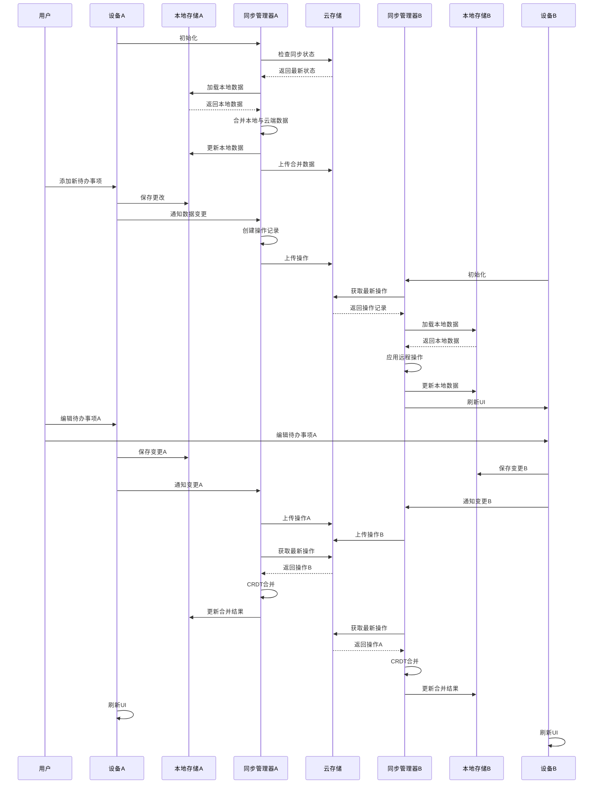

```mermaid
sequenceDiagram
    participant 用户
    participant 设备A
    participant 本地存储A
    participant 同步管理器A
    participant 云存储
    participant 同步管理器B
    participant 本地存储B
    participant 设备B
    
    %% 初始连接
    设备A->>同步管理器A: 初始化
    同步管理器A->>云存储: 检查同步状态
    云存储-->>同步管理器A: 返回最新状态
    同步管理器A->>本地存储A: 加载本地数据
    本地存储A-->>同步管理器A: 返回本地数据
    同步管理器A->>同步管理器A: 合并本地与云端数据
    同步管理器A->>本地存储A: 更新本地数据
    同步管理器A->>云存储: 上传合并数据
    
    %% 设备A上的更改
    用户->>设备A: 添加新待办事项
    设备A->>本地存储A: 保存更改
    设备A->>同步管理器A: 通知数据变更
    同步管理器A->>同步管理器A: 创建操作记录
    同步管理器A->>云存储: 上传操作
    
    %% 设备B连接并同步
    设备B->>同步管理器B: 初始化
    同步管理器B->>云存储: 获取最新操作
    云存储-->>同步管理器B: 返回操作记录
    同步管理器B->>本地存储B: 加载本地数据
    本地存储B-->>同步管理器B: 返回本地数据
    同步管理器B->>同步管理器B: 应用远程操作
    同步管理器B->>本地存储B: 更新本地数据
    同步管理器B->>设备B: 刷新UI
    
    %% 并发操作
    用户->>设备A: 编辑待办事项A
    用户->>设备B: 编辑待办事项A
    
    设备A->>本地存储A: 保存变更A
    设备B->>本地存储B: 保存变更B
    
    设备A->>同步管理器A: 通知变更A
    设备B->>同步管理器B: 通知变更B
    
    同步管理器A->>云存储: 上传操作A
    同步管理器B->>云存储: 上传操作B
    
    %% 设备同步并解决冲突
    同步管理器A->>云存储: 获取最新操作
    云存储-->>同步管理器A: 返回操作B
    同步管理器A->>同步管理器A: CRDT合并
    同步管理器A->>本地存储A: 更新合并结果
    
    同步管理器B->>云存储: 获取最新操作
    云存储-->>同步管理器B: 返回操作A
    同步管理器B->>同步管理器B: CRDT合并
    同步管理器B->>本地存储B: 更新合并结果
    
    %% 最终一致
    设备A->>设备A: 刷新UI
    设备B->>设备B: 刷新UI
```