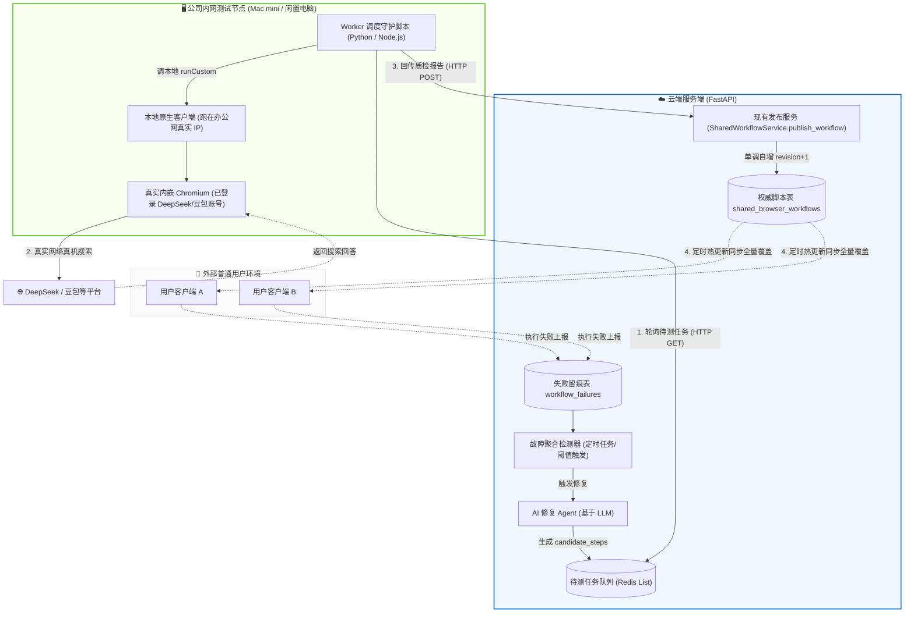

```mermaid
flowchart TB
    subgraph 生产环境 ["👥 外部普通用户环境"]
        C1["用户客户端 A"]
        C2["用户客户端 B"]
    end

    subgraph 云端大脑 ["☁️ 云端服务端 (FastAPI)"]
        direction TB
        F_DB[("失败留痕表 workflow_failures")]
        Agg["故障聚合检测器 (定时任务/阈值触发)"]
        Agent["AI 修复 Agent (基于 LLM)"]
        Queue[("待测任务队列 (Redis List)")]
        W_DB[("权威脚本表 shared_browser_workflows")]
        PubAPI["现有发布服务 (SharedWorkflowService.publish_workflow)"]

        F_DB --> Agg
        Agg -->|"触发修复"| Agent
        Agent -->|"生成 candidate_steps"| Queue
        PubAPI -->|"单调自增 revision+1"| W_DB
    end

    subgraph 内网真机环境 ["🖥️ 公司内网测试节点 (Mac mini / 闲置电脑)"]
        direction TB
        Runner["Worker 调度守护脚本 (Python / Node.js)"]
        LocalApp["本地原生客户端 (跑在办公网真实 IP)"]
        RealBrowser["真实内嵌 Chromium (已登录 DeepSeek/豆包账号)"]

        Runner -->|"调本地 runCustom"| LocalApp
        LocalApp --> RealBrowser
    end

    %% 联动关系
    C1 -.->|"执行失败上报"| F_DB
    C2 -.->|"执行失败上报"| F_DB

    Runner -->|"1. 轮询待测任务 (HTTP GET)"| Queue
    RealBrowser -->|"2. 真实网络真机搜索"| Target["🌐 DeepSeek / 豆包等平台"]
    Target -.->|"返回搜索回答"| RealBrowser
    Runner -->|"3. 回传质检报告 (HTTP POST)"| PubAPI

    W_DB -.->|"4. 定时热更新同步全量覆盖"| C1
    W_DB -.->|"4. 定时热更新同步全量覆盖"| C2

    style 云端大脑 fill:#f0f7ff,stroke:#0066cc,stroke-width:2px
    style 内网真机环境 fill:#f6ffed,stroke:#52c41a,stroke-width:2px
    style 生产环境 fill:#fafafa,stroke:#d9d9d9,stroke-width:1px

```