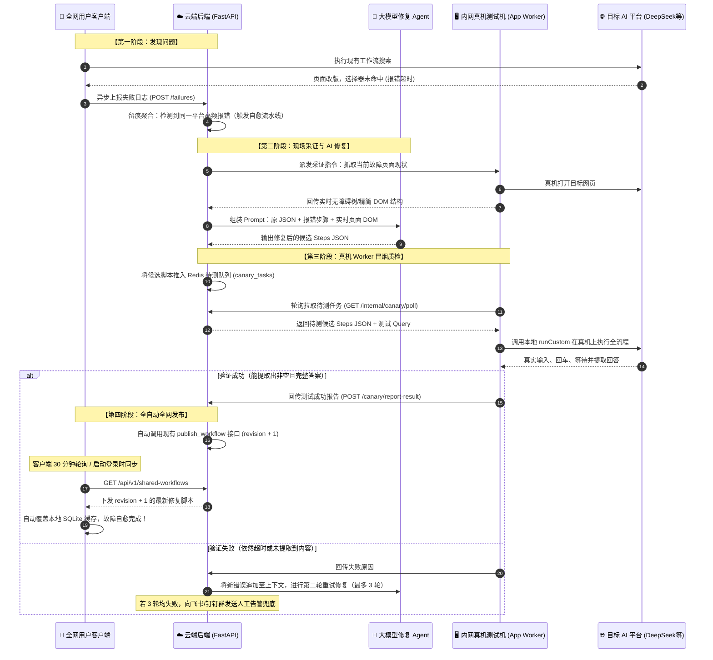

```mermaid
sequenceDiagram
    autonumber
    participant Client as 👥 全网用户客户端
    participant Server as ☁️ 云端后端 (FastAPI)
    participant AI as 🧠 大模型修复 Agent
    participant Tester as 🖥️ 内网真机测试机 (App Worker)
    participant Platform as 🌐 目标 AI 平台 (DeepSeek等)

    %% 1. 发现问题
    Note over Client, Server: 【第一阶段：发现问题】
    Client->>Platform: 执行现有工作流搜索
    Platform-->>Client: 页面改版，选择器未命中 (报错超时)
    Client->>Server: 异步上报失败日志 (POST /failures)
    Server->>Server: 留痕聚合：检测到同一平台高频报错（触发自愈流水线）

    %% 2. 现场采证与修复
    Note over Server, AI: 【第二阶段：现场采证与 AI 修复】
    Server->>Tester: 派发采证指令：抓取当前故障页面现状
    Tester->>Platform: 真机打开目标网页
    Tester-->>Server: 回传实时无障碍树/精简 DOM 结构
    Server->>AI: 组装 Prompt：原 JSON + 报错步骤 + 实时页面 DOM
    AI-->>Server: 输出修复后的候选 Steps JSON

    %% 3. 真机 Worker 质检测试
    Note over Server, Tester: 【第三阶段：真机 Worker 冒烟质检】
    Server->>Server: 将候选脚本推入 Redis 待测队列 (canary_tasks)
    Tester->>Server: 轮询拉取待测任务 (GET /internal/canary/poll)
    Server-->>Tester: 返回待测候选 Steps JSON + 测试 Query
    Tester->>Platform: 调用本地 runCustom 在真机上执行全流程
    Platform-->>Tester: 真实输入、回车、等待并提取回答
    
    alt 验证成功（能提取出非空且完整答案）
        Tester->>Server: 回传测试成功报告 (POST /canary/report-result)
        
        %% 4. 自动全网发布
        Note over Server, Client: 【第四阶段：全自动全网发布】
        Server->>Server: 自动调用现有 publish_workflow 接口 (revision + 1)
        Note over Client: 客户端 30 分钟轮询 / 启动登录时同步
        Client->>Server: GET /api/v1/shared-workflows
        Server-->>Client: 下发 revision + 1 的最新修复脚本
        Client->>Client: 自动覆盖本地 SQLite 缓存，故障自愈完成！
    else 验证失败（依然超时或未提取到内容）
        Tester->>Server: 回传失败原因
        Server->>AI: 将新错误追加至上下文，进行第二轮重试修复（最多 3 轮）
        Note over Server: 若 3 轮均失败，向飞书/钉钉群发送人工告警兜底
    end

```