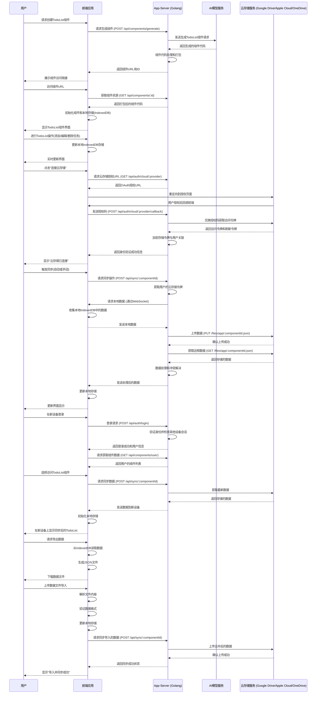

```mermaid
sequenceDiagram
    participant 用户
    participant 前端 as 前端应用
    participant 后端 as App-Server (Golang)
    participant 大模型 as AI模型服务
    participant 云存储 as 云存储服务 (Google Drive/Apple Cloud/OneDrive)
    
    %% 组件生成流程
    用户->>前端: 请求创建TodoList组件
    前端->>后端: 请求生成组件 (POST /api/components/generate)
    后端->>大模型: 发送生成TodoList组件请求
    大模型-->>后端: 返回生成的组件代码
    后端->>后端: 组件代码处理和打包
    后端-->>前端: 返回组件URL和ID
    前端-->>用户: 展示组件访问链接
    
    %% 组件初始化和本地存储
    用户->>前端: 访问组件URL
    前端->>后端: 获取组件资源 (GET /api/components/:id)
    后端-->>前端: 返回打包后的组件代码
    前端->>前端: 初始化组件和本地存储(IndexedDB)
    前端-->>用户: 显示TodoList组件界面
    
    %% 本地操作和存储
    用户->>前端: 进行TodoList操作(添加/编辑/删除任务)
    前端->>前端: 更新本地IndexedDB存储
    前端-->>用户: 实时更新界面
    
    %% 云存储身份认证流程
    用户->>前端: 点击"连接云存储"
    前端->>后端: 请求云存储授权URL (GET /api/auth/cloud/:provider)
    后端-->>前端: 返回OAuth授权URL
    前端->>云存储: 重定向到授权页面
    云存储->>前端: 用户授权后回调前端
    前端->>后端: 发送授权码 (POST /api/auth/cloud/:provider/callback)
    后端->>云存储: 交换授权码获取访问令牌
    云存储-->>后端: 返回访问令牌和刷新令牌
    后端->>后端: 加密存储令牌与用户关联
    后端-->>前端: 返回身份验证成功信息
    前端-->>用户: 显示"云存储已连接"
    
    %% 数据同步流程
    用户->>前端: 触发同步(自动或手动)
    前端->>后端: 请求同步操作 (POST /api/sync/:componentId)
    后端->>后端: 获取用户的云存储令牌
    
    %% 上传流程
    后端->>前端: 请求本地数据 (通过WebSocket)
    前端->>前端: 收集本地IndexedDB中的数据
    前端-->>后端: 发送本地数据
    后端->>云存储: 上传数据 (PUT /files/app/:componentId.json)
    云存储-->>后端: 确认上传成功
    
    %% 下载流程
    后端->>云存储: 获取远程数据 (GET /files/app/:componentId.json)
    云存储-->>后端: 返回存储的数据
    后端->>后端: 数据处理和冲突解决
    后端-->>前端: 发送处理后的数据
    前端->>前端: 更新本地存储
    前端-->>用户: 更新界面显示
    
    %% 多设备登录场景
    用户->>前端: 在新设备登录
    前端->>后端: 登录请求 (POST /api/auth/login)
    后端->>后端: 验证身份并检查其他设备会话
    后端-->>前端: 返回登录成功和用户信息
    前端->>后端: 请求获取组件数据 (GET /api/components/user)
    后端-->>前端: 返回用户的组件列表
    用户->>前端: 选择访问TodoList组件
    前端->>后端: 请求同步数据 (POST /api/sync/:componentId)
    后端->>云存储: 获取最新数据
    云存储-->>后端: 返回存储的数据
    后端-->>前端: 发送数据到新设备
    前端->>前端: 初始化本地存储
    前端-->>用户: 在新设备上显示同步后的TodoList
    
    %% 导入导出功能
    用户->>前端: 请求导出数据
    前端->>前端: 从IndexedDB读取数据
    前端->>前端: 生成JSON文件
    前端-->>用户: 下载数据文件
    
    用户->>前端: 上传数据文件导入
    前端->>前端: 解析文件内容
    前端->>前端: 验证数据格式
    前端->>前端: 更新本地存储
    前端->>后端: 请求同步导入的数据 (POST /api/sync/:componentId)
    后端->>云存储: 上传合并后的数据
    云存储-->>后端: 确认上传成功
    后端-->>前端: 返回同步成功状态
    前端-->>用户: 显示"导入并同步成功"
```