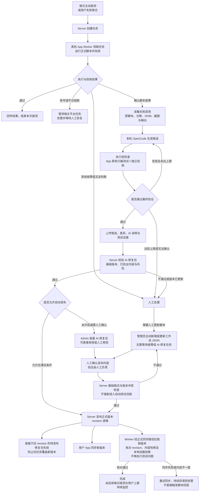

```mermaid
flowchart TB
    A["每日主动拨测<br/>或用户失败聚合"] --> B["Server 创建任务"]
    B --> C["真机 App Worker 领取任务<br/>运行正式脚本并验收"]
    C --> D{"执行与验收结果"}
    D -->|通过| E["回传结果，结束本次拨测"]
    D -->|账号或平台阻断| F["暂停相关平台任务<br/>告警并等待人工恢复"]
    D -->|确认脚本故障| G["采集失败现场<br/>原脚本、诊断、DOM、截图与输出"]
    D -->|其他故障或无法判断| H["人工处理"]
    G --> I["本机 OpenCode 生成候选"]
    I --> J["执行前检查<br/>App 原执行器测试＋独立验收"]
    J --> K{"是否通过最终验证"}
    K -->|失败且未达上限| I
    K -->|达到上限或无法确认| H
    K -->|通过| L["上传候选、差异、AI 说明与测试证据"]
    L --> M["Server 校验 AI 修复包<br/>基础版本、已验证内容与风险"]
    M -->|不通过或版本已更新| H
    M -->|通过| N{"是否允许自动发布"}
    N -->|允许且满足条件| P["Server 发布正式版本<br/>revision 递增"]
    N -->|未开启或需人工确认| O["Admin 查看 AI 修复包<br/>可直接采用或人工修改"]
    O --> V["人工确认发布内容<br/>验证由人工负责"]
    U["管理员主动新增或更新工作流 JSON<br/>无需等待故障或 AI 修复任务"] --> V
    H -->|需要人工更新脚本| U
    V --> W["Server 基础格式与版本冲突检查<br/>不强制进入自动测试流程"]
    W -->|通过| P
    W -->|不通过| U
    P --> X["使基于旧 revision 的待发布修复包失效<br/>防止旧任务覆盖新版本"]
    P --> Q["用户 App 同步新版本"]
    P --> R["Worker 经正式同步路径拉取新版本<br/>核对 revision、内容哈希及本地加载结果<br/>不再执行测试问题"]
    R -->|核对通过| S["完成<br/>由后续每日拨测与用户上报持续监控"]
    R -->|同步失败或内容不一致| T["重试同步，持续异常则告警<br/>不直接触发脚本回滚"]
```