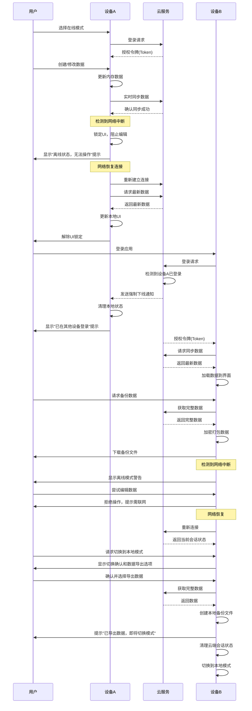

```mermaid
sequenceDiagram
    participant 用户
    participant 设备A
    participant 云服务
    participant 设备B
    
    %% 初始设置
    用户->>设备A: 选择在线模式
    设备A->>云服务: 登录请求
    云服务-->>设备A: 授权令牌(Token)
    
    %% 实时数据同步
    用户->>设备A: 创建/修改数据
    设备A->>设备A: 更新内存数据
    设备A->>云服务: 实时同步数据
    云服务-->>设备A: 确认同步成功
    
    %% 网络状态检测
    Note over 设备A: 检测到网络中断
    设备A->>设备A: 锁定UI，阻止编辑
    设备A->>用户: 显示"离线状态，无法操作"提示
    Note over 设备A: 网络恢复连接
    设备A->>云服务: 重新建立连接
    设备A->>云服务: 请求最新数据
    云服务-->>设备A: 返回最新数据
    设备A->>设备A: 更新本地UI
    设备A->>用户: 解除UI锁定
    
    %% 设备切换
    用户->>设备B: 登录应用
    设备B->>云服务: 登录请求
    云服务->>云服务: 检测到设备A已登录
    云服务-->>设备A: 发送强制下线通知
    设备A->>设备A: 清理本地状态
    设备A->>用户: 显示"已在其他设备登录"提示
    云服务-->>设备B: 授权令牌(Token)
    设备B->>云服务: 请求同步数据
    云服务-->>设备B: 返回最新数据
    设备B->>设备B: 加载数据到界面
    
    %% 备份与恢复
    用户->>设备B: 请求备份数据
    设备B->>云服务: 获取完整数据
    云服务-->>设备B: 返回完整数据
    设备B->>设备B: 加密打包数据
    设备B->>用户: 下载备份文件
    
    %% 断网尝试编辑场景
    Note over 设备B: 检测到网络中断
    设备B->>用户: 显示离线模式警告
    用户->>设备B: 尝试编辑数据
    设备B->>用户: 拒绝操作，提示需联网
    Note over 设备B: 网络恢复
    设备B->>云服务: 重新连接
    云服务-->>设备B: 返回当前会话状态
    
    %% 模式切换
    用户->>设备B: 请求切换到本地模式
    设备B->>用户: 显示切换确认和数据导出选项
    用户->>设备B: 确认并选择导出数据
    设备B->>云服务: 获取完整数据
    云服务-->>设备B: 返回数据
    设备B->>设备B: 创建本地备份文件
    设备B->>用户: 提示"已导出数据，即将切换模式"
    设备B->>设备B: 清理云端会话状态
    设备B->>设备B: 切换到本地模式
```