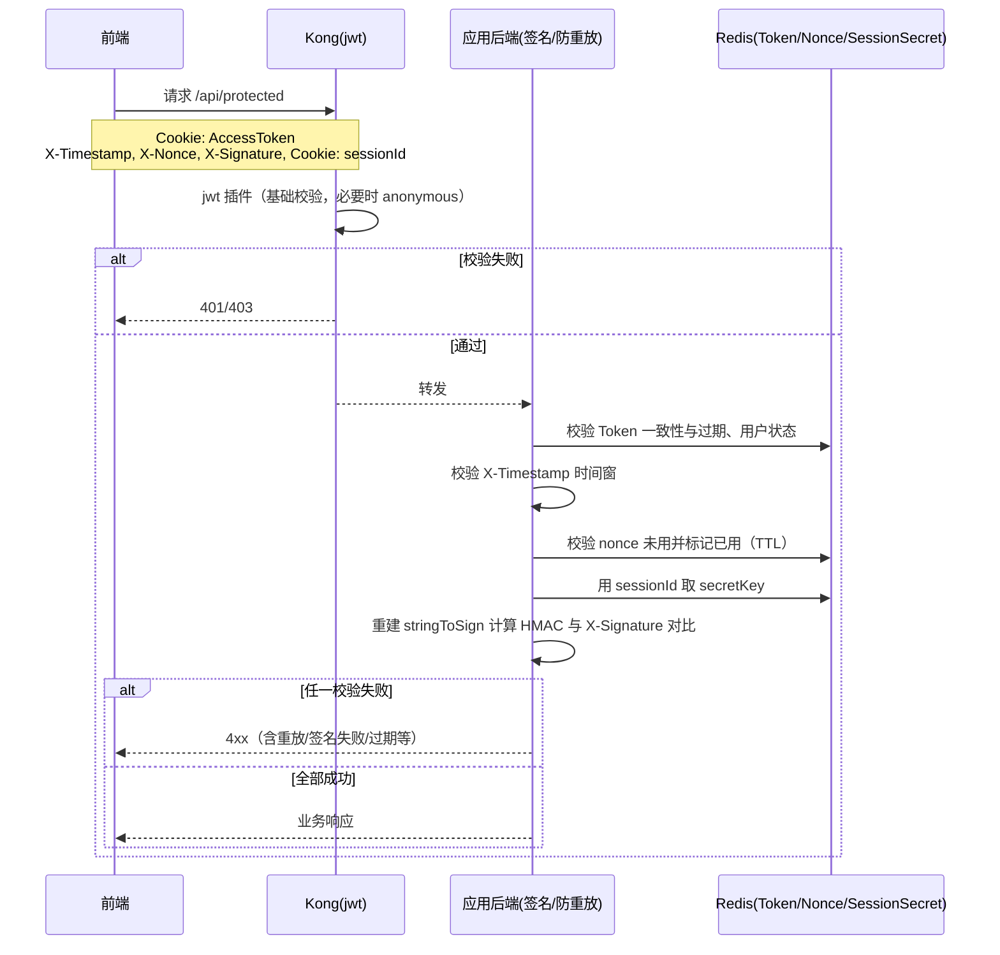

```mermaid
sequenceDiagram
    participant FE as 前端
    participant Kong as Kong(jwt)
    participant App as 应用后端(签名/防重放)
    participant Redis as Redis(Token/Nonce/SessionSecret)

    FE->>Kong: 请求 /api/protected
    Note over FE,Kong: Cookie: AccessToken<br/>X-Timestamp, X-Nonce, X-Signature, Cookie: sessionId

    Kong->>Kong: jwt 插件（基础校验，必要时 anonymous）
    alt 校验失败
      Kong-->>FE: 401/403
    else 通过
      Kong-->>App: 转发
      App->>Redis: 校验 Token 一致性与过期、用户状态
      App->>App: 校验 X-Timestamp 时间窗
      App->>Redis: 校验 nonce 未用并标记已用（TTL）
      App->>Redis: 用 sessionId 取 secretKey
      App->>App: 重建 stringToSign 计算 HMAC 与 X-Signature 对比
      alt 任一校验失败
        App-->>FE: 4xx（含重放/签名失败/过期等）
      else 全部成功
        App-->>FE: 业务响应
      end
    end
```