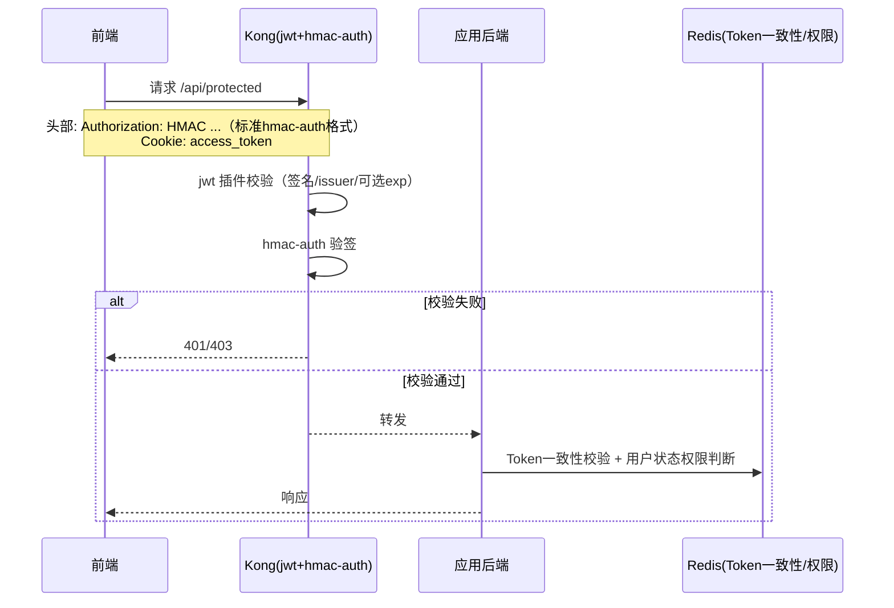

```mermaid
sequenceDiagram
    participant FE as 前端
    participant Kong as Kong(jwt+hmac-auth)
    participant App as 应用后端
    participant Redis as Redis(Token一致性/权限)

    FE->>Kong: 请求 /api/protected
    Note over FE,Kong: 头部: Authorization: HMAC ...（标准hmac-auth格式）<br/>Cookie: access_token

    Kong->>Kong: jwt 插件校验（签名/issuer/可选exp）
    Kong->>Kong: hmac-auth 验签
    alt 校验失败
      Kong-->>FE: 401/403
    else 校验通过
      Kong-->>App: 转发
      App->>Redis: Token一致性校验 + 用户状态权限判断
      App-->>FE: 响应
    end
```