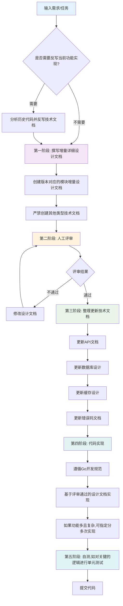

```mermaid
flowchart TD
    A[输入需求/任务] --> B{是否需要反写当前功能实现?}
    B -->|需要| C[分析历史代码并反写技术文档]
    B -->|不需要| D[第一阶段: 撰写增量详细设计文档]
    C --> D
    
    D --> E[创建版本对应的模块增量设计文档]
    E --> F[严禁创建其他类型技术文档]
    F --> G[第二阶段: 人工评审]
    G --> H{评审结果}
    H -->|不通过| I[修改设计文档]
    I --> G
    H -->|通过| J[第三阶段: 整理更新技术文档]
    J --> K[更新API文档]
    K --> L[更新数据库设计]
    L --> M[更新缓存设计]
    M --> N[更新错误码文档]
    N --> O[第四阶段: 代码实现]
    O --> P[遵循Go开发规范]
    P --> Q[基于评审通过的设计文档实现]
    Q --> R[如果功能多且复杂,可指定分多次实现]
    R --> S[第五阶段: 自测,如对关键的逻辑进行单元测试]
    S --> T[提交代码]
    
    style A fill:#e3f2fd
    style D fill:#f3e5f5
    style G fill:#fff3e0
    style J fill:#e8f5e8
    style O fill:#e0f2f1
    style S fill:#e0f3f6
```