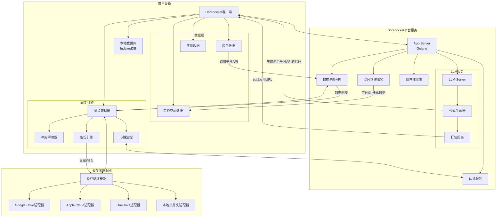

```mermaid
graph TD
    subgraph 用户设备
        Client[Dorapocket客户端]
        LocalDB[本地数据库<br/>IndexedDB]
        
        subgraph 数据层
            WorkspaceData[工作空间数据]
            AppData[应用数据]
            InstanceData[实例数据]
        end
        
        subgraph 同步引擎
            SyncManager[同步管理器]
            ConflictResolver[冲突解决器]
            HeartbeatMonitor[心跳监控]
            BackupEngine[备份引擎]
        end
    end
    
    subgraph Dorapocket平台服务
        AppServer[App-Server<br/>Golang]
        AuthService[认证服务]
        WorkspaceService[空间管理服务]
        ComponentRegistry[组件注册表]
        DataSyncAPI[数据同步API]
        
        subgraph LLM服务
            LLMServer[LLM-Server]
            CodeGenerator[代码生成器]
            PackageService[打包服务]
        end
    end
    
    subgraph 云存储适配器
        CloudConnector[云存储连接器]
        GoogleDriveAdapter[Google Drive适配器]
        AppleCloudAdapter[Apple Cloud适配器]
        OneDriveAdapter[OneDrive适配器]
        LocalFolderAdapter[本地文件夹适配器]
    end
    
    %% 用户设备内部连接
    Client --> LocalDB
    Client --> WorkspaceData
    Client --> AppData
    Client --> InstanceData
    Client --> SyncManager
    SyncManager --> ConflictResolver
    SyncManager --> HeartbeatMonitor
    SyncManager --> BackupEngine
    
    %% 平台服务内部连接
    AppServer --> AuthService
    AppServer --> WorkspaceService
    AppServer --> ComponentRegistry
    AppServer --> DataSyncAPI
    AppServer --> LLMServer
    LLMServer --> CodeGenerator
    CodeGenerator --> PackageService
    
    %% 设备与平台连接
    Client <--> AppServer
    SyncManager <--> DataSyncAPI
    HeartbeatMonitor <--> AuthService
    
    %% 设备与云存储连接
    SyncManager <--> CloudConnector
    CloudConnector --> GoogleDriveAdapter
    CloudConnector --> AppleCloudAdapter
    CloudConnector --> OneDriveAdapter
    CloudConnector --> LocalFolderAdapter
    
    %% 组件与平台API连接
    AppData -- "调用平台API" --> DataSyncAPI
    
    %% 数据流向
    CodeGenerator -- "生成调用平台API的代码" --> Client
    PackageService -- "返回应用URL" --> Client
    BackupEngine -- "导出/导入" --> CloudConnector
    
    %% 数据同步流
    DataSyncAPI -- "数据同步" --> SyncManager
    WorkspaceService -- "空间/组件元数据" --> WorkspaceData
```