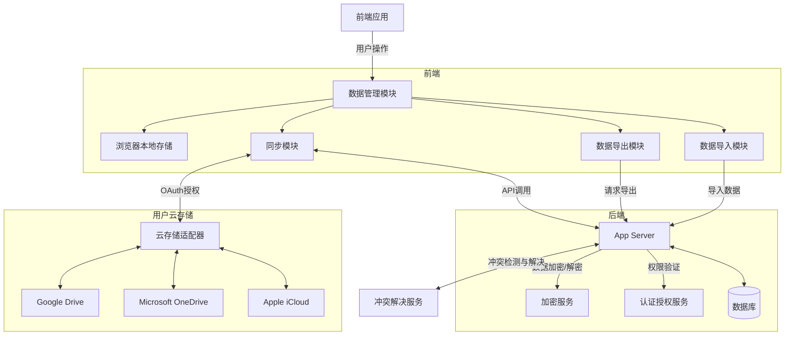

```mermaid
graph TD
    Client[前端应用] --> |用户操作| DataManagementModule[数据管理模块]
    
    subgraph 前端
        DataManagementModule --> LocalStorage[浏览器本地存储]
        DataManagementModule --> SyncModule[同步模块]
        DataManagementModule --> ExportModule[数据导出模块]
        DataManagementModule --> ImportModule[数据导入模块]
    end
    
    subgraph 后端
        SyncModule <--> |API调用| AppServer[App Server]
        ExportModule --> |请求导出| AppServer
        ImportModule --> |导入数据| AppServer
        AppServer --> |数据加密/解密| CryptoService[加密服务]
        AppServer --> |权限验证| AuthService[认证授权服务]
        AppServer <--> Database[(数据库)]
    end
    
    subgraph 用户云存储
        SyncModule <--> |OAuth授权| CloudStorageAdapter[云存储适配器]
        CloudStorageAdapter <--> GoogleDrive[Google Drive]
        CloudStorageAdapter <--> OneDrive[Microsoft OneDrive]
        CloudStorageAdapter <--> AppleCloud[Apple iCloud]
    end
    
    AppServer <--> |冲突检测与解决| ConflictResolver[冲突解决服务]
```