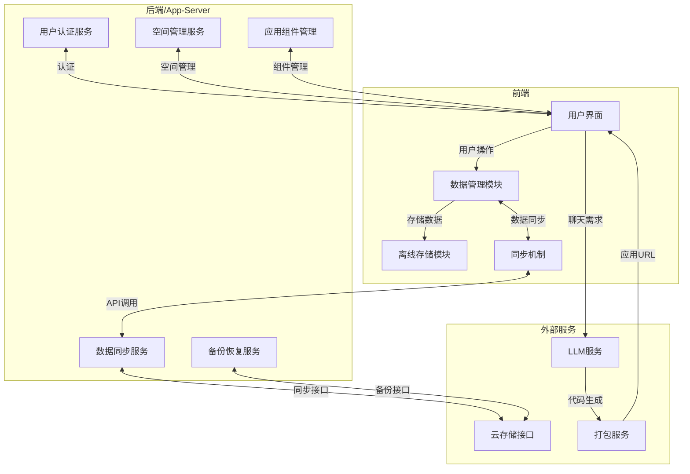

```mermaid
graph TB
    subgraph 前端
        A[用户界面]
        B[数据管理模块]
        C[离线存储模块]
        D[同步机制]
    end
    
    subgraph 后端/App-Server
        E[用户认证服务]
        F[空间管理服务]
        G[应用组件管理]
        H[数据同步服务]
        I[备份恢复服务]
    end
    
    subgraph 外部服务
        J[云存储接口]
        K[LLM服务]
        L[打包服务]
    end
    
    A -->|用户操作| B
    B -->|存储数据| C
    B <-->|数据同步| D
    D <-->|API调用| H
    E <-->|认证| A
    F <-->|空间管理| A
    G <-->|组件管理| A
    H <-->|同步接口| J
    I <-->|备份接口| J
    A -->|聊天需求| K
    K -->|代码生成| L
    L -->|应用URL| A
```