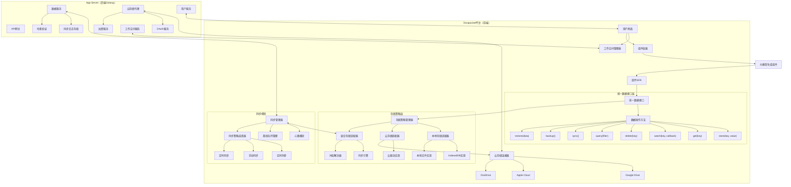

```mermaid
graph TD
    subgraph "Dorapocket平台（前端）"
        Client[用户界面] --> WorkspaceManager[工作空间管理器]
        Client --> ComponentContainer[组件容器]
        
        %% 统一数据操作入口
        subgraph "统一数据接口层"
            DataInterface[统一数据接口] --> DataOperations[数据操作方法]
            DataOperations --> StoreMethod["store(key, value)"]
            DataOperations --> GetMethod["get(key)"]
            DataOperations --> WatchMethod["watch(key, callback)"]
            DataOperations --> DeleteMethod["delete(key)"]
            DataOperations --> QueryMethod["query(filter)"]
            DataOperations --> SyncMethod["sync()"]
            DataOperations --> BackupMethod["backup()"]
            DataOperations --> RestoreMethod["restore(data)"]
        end
        
        %% 存储策略层
        subgraph "存储策略层"
            StorageStrategy[存储策略管理器]
            DataInterface --> StorageStrategy
            
            StorageStrategy --> LocalStorageAdapter[本地存储适配器]
            StorageStrategy --> CloudStorageAdapter[云存储适配器]
            StorageStrategy --> HybridStorageAdapter[混合存储适配器]
            
            LocalStorageAdapter --> IndexedDBImpl[IndexedDB实现]
            LocalStorageAdapter --> LocalFileImpl[本地文件实现]
            
            CloudStorageAdapter --> CloudDriverImpl[云驱动实现]
            
            HybridStorageAdapter --> SyncEngine[同步引擎]
            HybridStorageAdapter --> ConflictResolver[冲突解决器]
        end
        
        %% 同步机制
        subgraph "同步机制"
            SyncManager[同步管理器] <--> HybridStorageAdapter
            SyncManager --> HeartbeatModule[心跳模块]
            SyncManager --> OfflineQueueManager[离线队列管理]
            SyncManager --> SyncStrategySelector[同步策略选择器]
            
            SyncStrategySelector --> RealtimeSync[实时同步]
            SyncStrategySelector --> ManualSync[手动同步]
            SyncStrategySelector --> ScheduledSync[定时同步]
        end
        
        %% 云存储连接
        CloudStorageAdapter --> CloudConnector[云存储连接器]
        CloudConnector --> GoogleDriveConnector[Google Drive]
        CloudConnector --> AppleCloudConnector[Apple Cloud]
        CloudConnector --> OneDriveConnector[OneDrive]
        
        %% 组件SDK连接
        ComponentSDK[组件SDK] --> DataInterface
    end
    
    subgraph "App-Server（后端Golang）"
        APIGateway[API网关]
        
        %% 数据服务
        DataService[数据服务] <--> SyncManager
        DataService --> SyncLogStore[同步日志存储]
        DataService --> HashVerification[哈希验证]
        
        %% 云存储代理
        CloudProxy[云存储代理] <--> CloudConnector
        CloudProxy --> OAuthService[OAuth服务]
        CloudProxy --> EncryptionService[加密服务]
        
        %% 用户和工作空间管理
        UserService[用户服务] <--> Client
        WorkspaceService[工作空间服务] <--> WorkspaceManager
    end
    
    %% 组件与平台交互
    LLMGeneratedCode[大模型生成组件] --> ComponentSDK
    ComponentContainer --> LLMGeneratedCode
```