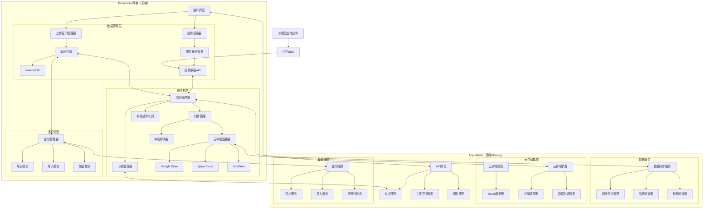

```mermaid
graph TD
    subgraph "Dorapocket平台（前端）"
        Client[用户界面] --> WorkspaceManager[工作空间管理器]
        Client --> ComponentRenderer[组件渲染器]
        
        subgraph "数据管理层"
            WorkspaceManager --> LocalStore[本地存储]
            ComponentRenderer --> ComponentState[组件状态管理]
            
            LocalStore --> IndexedDB[IndexedDB]
            ComponentState --> ComponentAPI[组件数据API]
        end
        
        subgraph "同步机制"
            SyncManager[同步管理器] --> SyncStrategy[同步策略]
            SyncManager --> HeartbeatMonitor[心跳监控器]
            SyncManager --> OfflineQueue[离线操作队列]
            
            SyncStrategy --> CloudConnector[云存储连接器]
            SyncStrategy --> ConflictResolver[冲突解决器]
            
            CloudConnector --> GoogleDriveAdapter[Google Drive]
            CloudConnector --> AppleCloudAdapter[Apple Cloud]
            CloudConnector --> OneDriveAdapter[OneDrive]
        end
        
        subgraph "备份恢复"
            BackupManager[备份管理器] --> ExportModule[导出模块]
            BackupManager --> ImportModule[导入模块]
            BackupManager --> EncryptionModule[加密模块]
        end
        
        ComponentAPI <--> SyncManager
        LocalStore <--> SyncManager
        LocalStore <--> BackupManager
    end
    
    subgraph "App-Server（后端Golang）"
        APIGateway[API网关] --> AuthService[认证服务]
        APIGateway --> WorkspaceService[工作空间服务]
        APIGateway --> ComponentService[组件服务]
        
        subgraph "数据服务"
            DataSyncService[数据同步服务] --> SyncLogManager[同步日志管理]
            DataSyncService --> HashVerifier[哈希验证器]
            DataSyncService --> DataValidator[数据验证器]
        end
        
        subgraph "云存储集成"
            CloudAuthService[云存储授权] --> OAuthManager[OAuth管理器]
            CloudStorageProxy[云存储代理] --> StorageAdapter[存储适配器]
            CloudStorageProxy --> EncryptionService[数据加密服务]
        end
        
        subgraph "备份服务"
            BackupService[备份服务] --> ExportService[导出服务]
            BackupService --> ImportService[导入服务]
            BackupService --> IntegrityChecker[完整性检查]
        end
    end
    
    %% 组件与平台交互
    ComponentSDK[组件SDK] --> ComponentAPI
    LLMGeneratedCode[大模型生成组件] --> ComponentSDK
    
    %% 前后端交互
    SyncManager <--> DataSyncService
    CloudConnector <--> CloudStorageProxy
    BackupManager <--> BackupService
    HeartbeatMonitor <--> AuthService
    Client <--> APIGateway
```