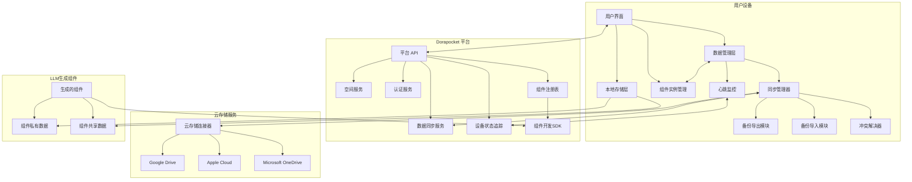

```mermaid
graph TD
    subgraph 用户设备
        Client[用户界面] --> LocalStorage[本地存储层]
        Client --> ComponentInstances[组件实例管理]
        Client --> DataManager[数据管理层]
        DataManager --> SyncManager[同步管理器]
        DataManager --> HeartbeatMonitor[心跳监控]
        SyncManager --> BackupExporter[备份导出模块]
        SyncManager --> BackupImporter[备份导入模块]
        SyncManager --> ConflictResolver[冲突解决器]
    end
    
    subgraph Dorapocket 平台
        PlatformAPI[平台 API] --> WorkspaceService[空间服务]
        PlatformAPI --> AuthService[认证服务]
        PlatformAPI --> ComponentRegistry[组件注册表]
        PlatformAPI --> DataSync[数据同步服务]
        PlatformAPI --> StatusTracker[设备状态追踪]
        ComponentRegistry --> ComponentSDK[组件开发SDK]
    end
    
    subgraph 云存储服务
        CloudConnector[云存储连接器] --> GoogleDrive[Google Drive]
        CloudConnector --> AppleCloud[Apple Cloud]
        CloudConnector --> OneDrive[Microsoft OneDrive]
    end
    
    subgraph LLM生成组件
        GenComponent[生成的组件] --> ComponentSDK
        GenComponent --> LocalComponentData[组件私有数据]
        GenComponent --> SharedComponentData[组件共享数据]
    end
    
    SyncManager <--> CloudConnector
    SyncManager <--> DataSync
    DataManager <--> ComponentInstances
    HeartbeatMonitor <--> StatusTracker
    Client <--> PlatformAPI
    LocalStorage --> LocalComponentData
    LocalStorage --> SharedComponentData
```