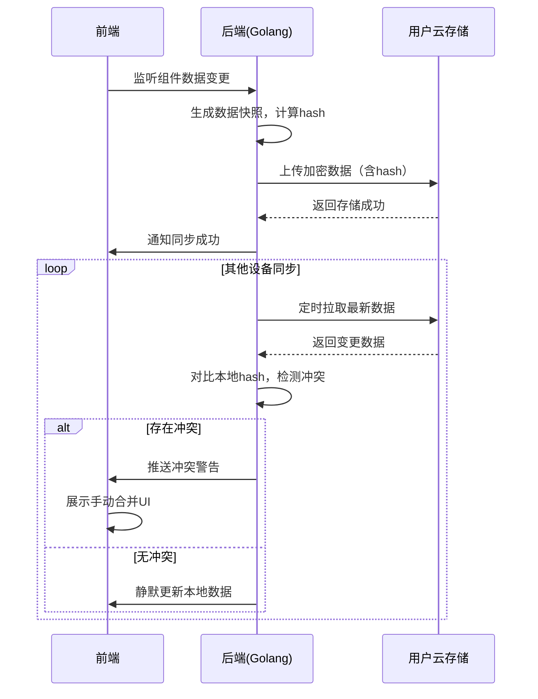

```mermaid
sequenceDiagram
    participant Frontend as 前端
    participant AppServer as 后端(Golang)
    participant Cloud as 用户云存储

    Frontend->>AppServer: 监听组件数据变更
    AppServer->>AppServer: 生成数据快照，计算hash
    AppServer->>Cloud: 上传加密数据（含hash）
    Cloud-->>AppServer: 返回存储成功
    AppServer->>Frontend: 通知同步成功

    loop 其他设备同步
        AppServer->>Cloud: 定时拉取最新数据
        Cloud-->>AppServer: 返回变更数据
        AppServer->>AppServer: 对比本地hash，检测冲突
        alt 存在冲突
            AppServer->>Frontend: 推送冲突警告
            Frontend->>Frontend: 展示手动合并UI
        else 无冲突
            AppServer->>Frontend: 静默更新本地数据
        end
    end
```