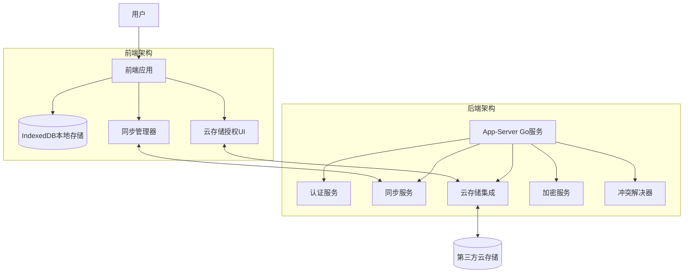

```mermaid
flowchart TD
    User[用户] --> FrontEnd[前端应用]
    
    subgraph 前端架构
        FrontEnd --> LocalDB[(IndexedDB本地存储)]
        FrontEnd --> SyncManager[同步管理器]
        FrontEnd --> CloudAuthUI[云存储授权UI]
    end
    
    subgraph 后端架构
        AppServer[App-Server Go服务] --> AuthService[认证服务]
        AppServer --> SyncService[同步服务]
        AppServer --> CloudIntegration[云存储集成]
        AppServer --> CryptoService[加密服务]
        AppServer --> ConflictResolver[冲突解决器]
    end
    
    SyncManager <--> SyncService
    CloudAuthUI <--> CloudIntegration
    CloudIntegration <--> ExternalCloud[(第三方云存储)]
```