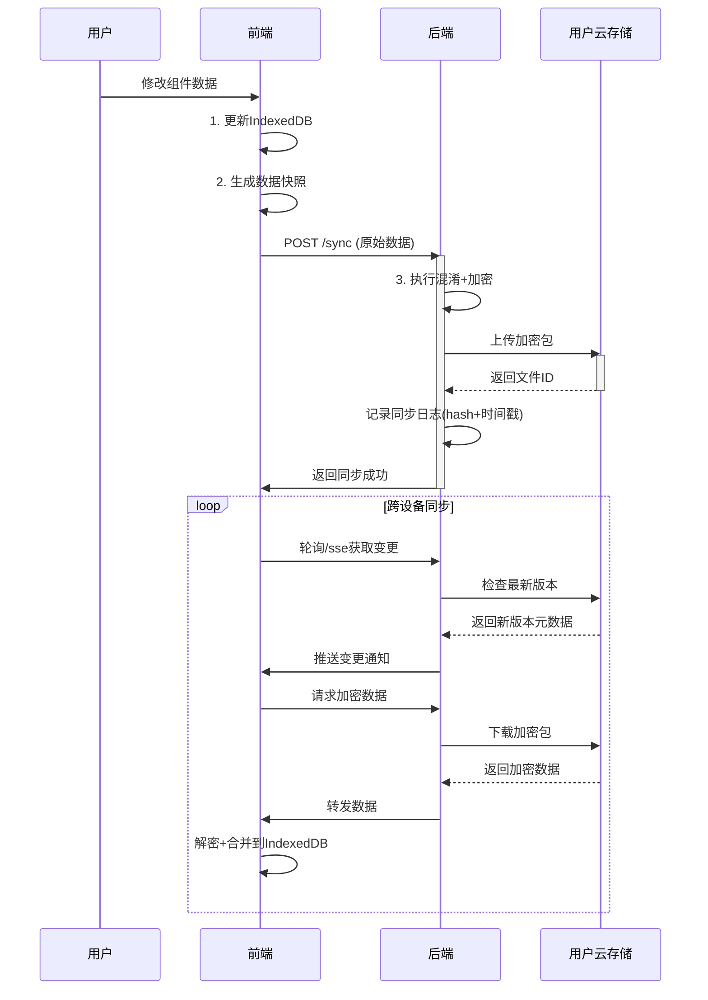

```mermaid
sequenceDiagram
    participant User as 用户
    participant Frontend as 前端
    participant AppServer as 后端
    participant Cloud as 用户云存储

    User->>Frontend: 修改组件数据
    Frontend->>Frontend: 1. 更新IndexedDB
    Frontend->>Frontend: 2. 生成数据快照
    Frontend->>AppServer: POST /sync (原始数据)
    activate AppServer
    AppServer->>AppServer: 3. 执行混淆+加密
    AppServer->>Cloud: 上传加密包
    activate Cloud
    Cloud-->>AppServer: 返回文件ID
    deactivate Cloud
    AppServer->>AppServer: 记录同步日志(hash+时间戳)
    AppServer->>Frontend: 返回同步成功
    deactivate AppServer

    loop 跨设备同步
        Frontend->>AppServer: 轮询/sse获取变更
        AppServer->>Cloud: 检查最新版本
        Cloud-->>AppServer: 返回新版本元数据
        AppServer->>Frontend: 推送变更通知
        Frontend->>AppServer: 请求加密数据
        AppServer->>Cloud: 下载加密包
        Cloud-->>AppServer: 返回加密数据
        AppServer->>Frontend: 转发数据
        Frontend->>Frontend: 解密+合并到IndexedDB
    end
```