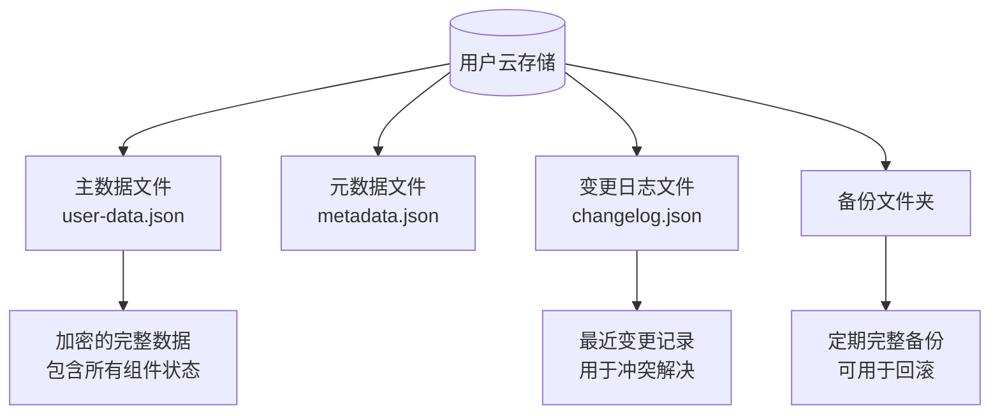

```mermaid
flowchart TD
    CloudStorage[(用户云存储)] --> MainDataFile[主数据文件<br>user-data.json]
    CloudStorage --> MetadataFile[元数据文件<br>metadata.json]
    CloudStorage --> ChangelogFile[变更日志文件<br>changelog.json]
    CloudStorage --> BackupFolder[备份文件夹]
    
    MainDataFile --> EncryptedFullData[加密的完整数据<br>包含所有组件状态]
    ChangelogFile --> EncryptedChanges[最近变更记录<br>用于冲突解决]
    BackupFolder --> PeriodicalBackups[定期完整备份<br>可用于回滚]
```