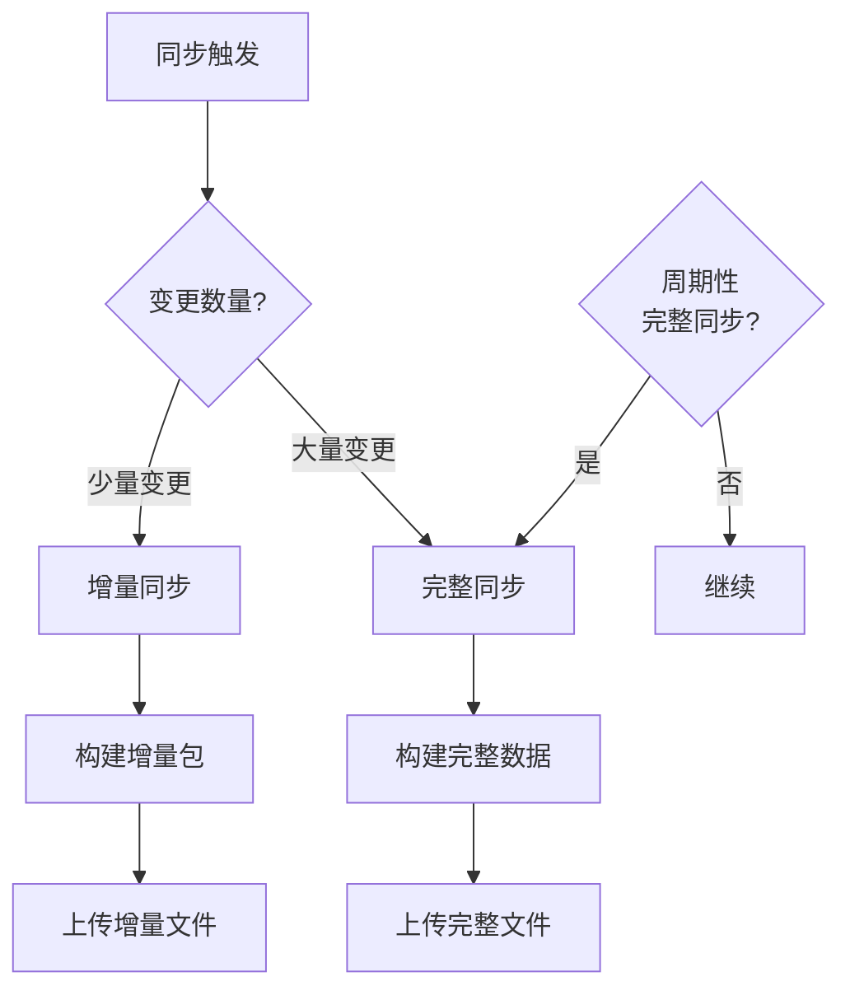

```mermaid
flowchart TD
    SyncTrigger[同步触发] --> CheckChanges{变更数量?}
    CheckChanges -->|少量变更| IncrementalSync[增量同步]
    CheckChanges -->|大量变更| FullSync[完整同步]
    
    IncrementalSync --> BuildDelta[构建增量包]
    BuildDelta --> UploadDelta[上传增量文件]
    
    FullSync --> BuildFull[构建完整数据]
    BuildFull --> UploadFull[上传完整文件]
    
    PeriodicCheck{周期性<br>完整同步?} -->|是| FullSync
    PeriodicCheck -->|否| Continue[继续]
```