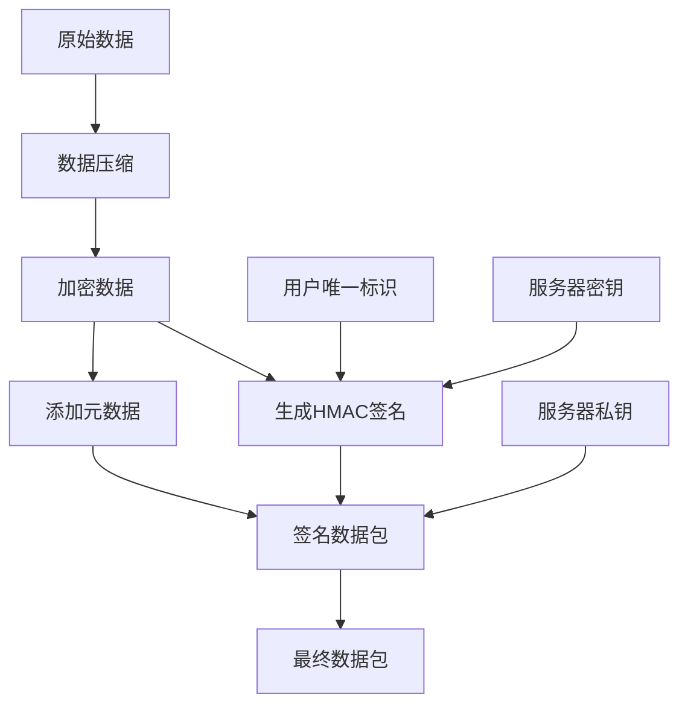

```mermaid
flowchart TD
    RawData[原始数据] --> CompressData[数据压缩]
    CompressData --> EncryptData[加密数据]
    EncryptData --> AddMetadata[添加元数据]
    
    UserID[用户唯一标识] --> GenerateHMAC[生成HMAC签名]
    ServerSecret[服务器密钥] --> GenerateHMAC
    EncryptData --> GenerateHMAC
    
    AddMetadata --> SignPayload[签名数据包]
    GenerateHMAC --> SignPayload
    ServerPrivateKey[服务器私钥] --> SignPayload
    
    SignPayload --> FinalPackage[最终数据包]
```