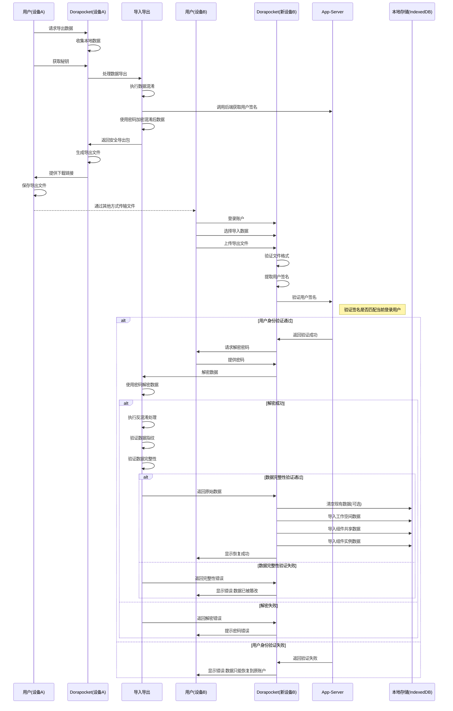

```mermaid
sequenceDiagram
    participant UserOld as 用户(设备A)
    participant AppOld as Dorapocket(设备A)
    participant Security as 导入导出
    participant UserNew as 用户(设备B)
    participant AppNew as Dorapocket(新设备B)
    participant AppServer as App-Server
    participant LocalDB as 本地存储(IndexedDB)
    
    %% 导出流程
    UserOld->>AppOld: 请求导出数据
    AppOld->>AppOld: 收集本地数据
    UserOld->>AppOld: 获取秘钥
    
    AppOld->>Security: 处理数据导出
    Security->>Security: 执行数据混淆
    Security->>AppServer: 调用后端获取用户签名
    Security->>Security: 使用密码加密混淆后数据
    Security->>AppOld: 返回安全导出包
    
    AppOld->>AppOld: 生成导出文件
    AppOld->>UserOld: 提供下载链接
    UserOld->>UserOld: 保存导出文件
    
    %% 传输文件(由用户完成)
    UserOld-->>UserNew: 通过其他方式传输文件
    
    %% 恢复流程
    UserNew->>AppNew: 登录账户
    UserNew->>AppNew: 选择导入数据
    UserNew->>AppNew: 上传导出文件
    
    AppNew->>AppNew: 验证文件格式
    AppNew->>AppNew: 提取用户签名
    
    AppNew->>AppServer: 验证用户签名
    note right of AppServer: 验证签名是否匹配当前登录用户
    
    alt 用户身份验证通过
        AppServer->>AppNew: 返回验证成功
        AppNew->>UserNew: 请求解密密码
        UserNew->>AppNew: 提供密码
        
        AppNew->>Security: 解密数据
        Security->>Security: 使用密码解密数据
        
        alt 解密成功
            Security->>Security: 执行反混淆处理
            Security->>Security: 验证数据指纹
            Security->>Security: 验证数据完整性
            
            alt 数据完整性验证通过
                Security->>AppNew: 返回原始数据
                AppNew->>LocalDB: 清空现有数据(可选)
                AppNew->>LocalDB: 导入工作空间数据
                AppNew->>LocalDB: 导入组件共享数据
                AppNew->>LocalDB: 导入组件实例数据
                AppNew->>UserNew: 显示恢复成功
            else 数据完整性验证失败
                Security->>AppNew: 返回完整性错误
                AppNew->>UserNew: 显示错误:数据已被篡改
            end
        else 解密失败
            Security->>AppNew: 返回解密错误
            AppNew->>UserNew: 提示密码错误
        end
    else 用户身份验证失败
        AppServer->>AppNew: 返回验证失败
        AppNew->>UserNew: 显示错误:数据只能恢复到原账户
    end
```