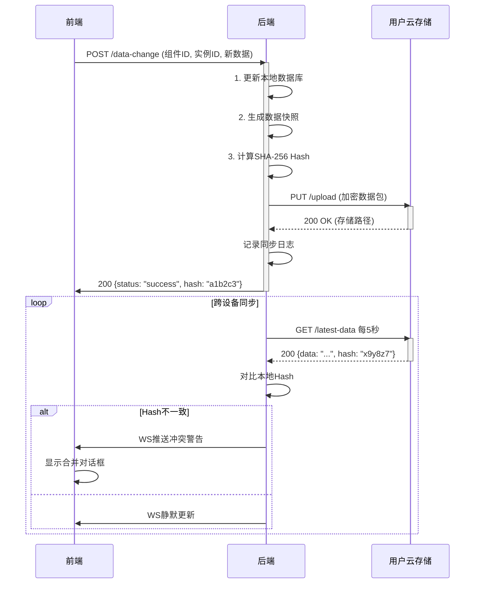

```mermaid
sequenceDiagram
    participant Frontend as 前端
    participant AppServer as 后端
    participant Cloud as 用户云存储

    Frontend->>AppServer: POST /data-change (组件ID, 实例ID, 新数据)
    activate AppServer
    AppServer->>AppServer: 1. 更新本地数据库
    AppServer->>AppServer: 2. 生成数据快照
    AppServer->>AppServer: 3. 计算SHA-256 Hash
    AppServer->>Cloud: PUT /upload (加密数据包)
    activate Cloud
    Cloud-->>AppServer: 200 OK (存储路径)
    deactivate Cloud
    AppServer->>AppServer: 记录同步日志
    AppServer->>Frontend: 200 {status: "success", hash: "a1b2c3"}
    deactivate AppServer

    loop 跨设备同步
        AppServer->>Cloud: GET /latest-data 每5秒
        activate Cloud
        Cloud-->>AppServer: 200 {data: "...", hash: "x9y8z7"}
        deactivate Cloud
        AppServer->>AppServer: 对比本地Hash
        alt Hash不一致
            AppServer->>Frontend: WS推送冲突警告
            Frontend->>Frontend: 显示合并对话框
        else
            AppServer->>Frontend: WS静默更新
        end
    end
```