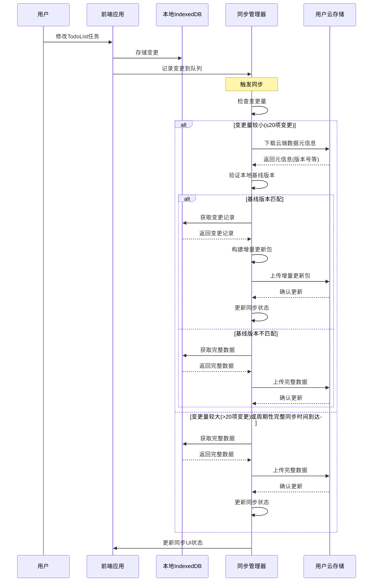

```mermaid
sequenceDiagram
    participant User as 用户
    participant Frontend as 前端应用
    participant LocalDB as 本地IndexedDB
    participant SyncM as 同步管理器
    participant Cloud as 用户云存储
    
    User->>Frontend: 修改TodoList任务
    Frontend->>LocalDB: 存储变更
    Frontend->>SyncM: 记录变更到队列
    
    note over SyncM: 触发同步
    
    SyncM->>SyncM: 检查变更量
    
    alt 变更量较小(≤20项变更)
        SyncM->>Cloud: 下载云端数据元信息
        Cloud-->>SyncM: 返回元信息(版本号等)
        SyncM->>SyncM: 验证本地基线版本
        
        alt 基线版本匹配
            SyncM->>LocalDB: 获取变更记录
            LocalDB-->>SyncM: 返回变更记录
            SyncM->>SyncM: 构建增量更新包
            SyncM->>Cloud: 上传增量更新包
            Cloud-->>SyncM: 确认更新
            SyncM->>SyncM: 更新同步状态
        else 基线版本不匹配
            SyncM->>LocalDB: 获取完整数据
            LocalDB-->>SyncM: 返回完整数据
            SyncM->>Cloud: 上传完整数据
            Cloud-->>SyncM: 确认更新
        end
        
    else 变更量较大(>20项变更)或周期性完整同步时间到达
        SyncM->>LocalDB: 获取完整数据
        LocalDB-->>SyncM: 返回完整数据
        SyncM->>Cloud: 上传完整数据
        Cloud-->>SyncM: 确认更新
        SyncM->>SyncM: 更新同步状态
    end
    
    SyncM->>Frontend: 更新同步UI状态
```