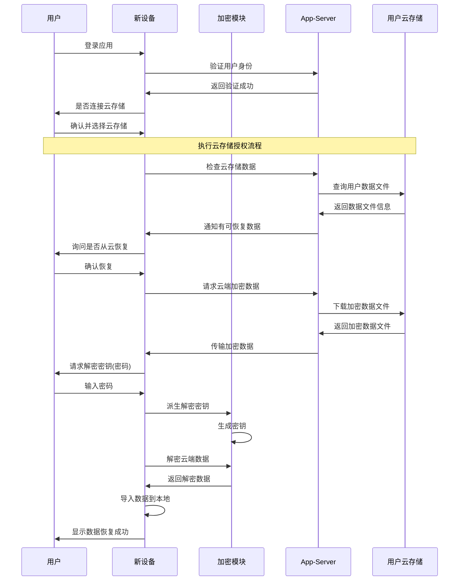

```mermaid
sequenceDiagram
    participant User as 用户
    participant NewDevice as 新设备
    participant CryptoM as 加密模块
    participant AppServer as App-Server
    participant UserCloud as 用户云存储
    
    User->>NewDevice: 登录应用
    NewDevice->>AppServer: 验证用户身份
    AppServer->>NewDevice: 返回验证成功
    
    NewDevice->>User: 是否连接云存储
    User->>NewDevice: 确认并选择云存储
    
    note over User,UserCloud: 执行云存储授权流程
    
    NewDevice->>AppServer: 检查云存储数据
    AppServer->>UserCloud: 查询用户数据文件
    UserCloud->>AppServer: 返回数据文件信息
    
    AppServer->>NewDevice: 通知有可恢复数据
    NewDevice->>User: 询问是否从云恢复
    User->>NewDevice: 确认恢复
    
    NewDevice->>AppServer: 请求云端加密数据
    AppServer->>UserCloud: 下载加密数据文件
    UserCloud->>AppServer: 返回加密数据文件
    AppServer->>NewDevice: 传输加密数据
    
    NewDevice->>User: 请求解密密钥(密码)
    User->>NewDevice: 输入密码
    NewDevice->>CryptoM: 派生解密密钥
    CryptoM->>CryptoM: 生成密钥
    
    NewDevice->>CryptoM: 解密云端数据
    CryptoM->>NewDevice: 返回解密数据
    NewDevice->>NewDevice: 导入数据到本地
    NewDevice->>User: 显示数据恢复成功
```